# 线程池

## 线程池概念

### 什么是“池”？

* 软件中的“池”，可以理解为计划经济

* 如果不使用线程池，每个任务都新开一个线程处理

  * 一个线程

  * for循环创建线程

  * 当任务数量上升到1000

    这样开销太大，我们希望有固定数量的线程，来执行这1000个线程，这样就避免了反复创建并销毁线程所带来的开销问题 

### 为什么使用线程池？

* 问题一：反复创建线程开销大
* 问题二：过多的线程会占用太多内存
* 解决以上两个问题的思路
  * 用少量的线程——避免内存占用过多
  * 让这部分线程都保持工作，且可以反复执行任务——避免生命周期的损耗。


## 线程池基本使用

### 线程池构造方法参数

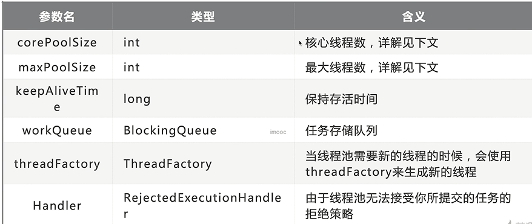

* corePoolSize指的是核心线程数

  线程池在完成初始化后，默认情况下，线程池中并没有任何线程，线程池会等待有任务到来时，再创建新线程去执行任务。

* 最大量maxPoolSize

  在核心线程数的基础上，额外增加的线程数的上限。

  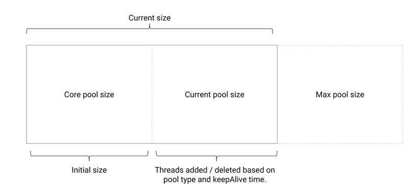

### 添加线程规则

* 如果线程数小于corePoolSize，创建一个新线程来运行新任务。

* 如果线程数等于（或大于）corePoolSize，但少于maxPoolSize，则将任务放入队列。

* 如果队列已满，并且线程数小于maxPoolSize，则创建一个新线程。

* 如果队列已满，并且线程数大于或等于maxPoolSize，则拒绝。

  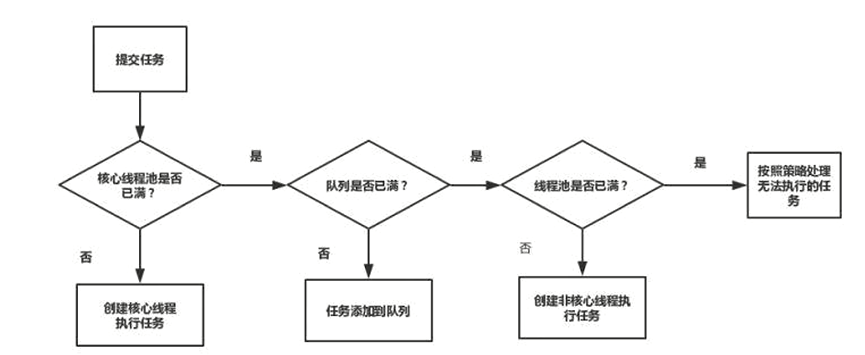

* 线程池应该手动创建还是自动创建
* 线程池里的线程数量设定为多少比较合适？
* 停止线程池的方法

### 增减线程的特点

* 通过设置corePoolSize和maxPoolSize相同，就可以创建固定大小的线程池。
* 线程池希望保持较少的线程数，并且只有在负载变的很大时才增加它。
* 通过设置maxPoolSize为很高的值，可以允许线程池容纳任意数量的并发任务。
* 只有在队列填满时才创建多余corePoolSize的线程，如果使用的是无界队列，那么线程数就不会超过corePoolSize。

### keepAliveTime

* 如果线程池当前的线程数多于corePoolSize，那么如果多余的线程空闲时间超过keepAliveTime，它们就会被终止。

### ThreadFactory用来创建线程

* 默认使用Executors.defaultThreadFactory()
* 创建出来的线程都在同一个线程组
* 如果自己指定ThreadFactory，那么就可以改变线程名、线程组、优先级、是否是守护线程等。

### WorkQueue工作队列

* 有3种最常见的队列类型
  * 直接交接：SynchronousQueue
  * 无界队列：LinkedBlockingQueue  （OOM内存溢出）
  * 有界队列：ArrayBlockingQueue（推荐使用）

### 自动创建线程池风险

* 手动创建更好，因为这样可以更加明确线程池的运行规则，避免资源耗尽的风险。

* 自动创建线程池（即直接调用JDK封装好的构造方法）可能带来哪些问题？

* newFixedThreadPool

  ```java
  public class FixedThreadPoolTest {
  
  	public static void main(String[] args) {
  		
  		ExecutorService executionService = Executors.newFixedThreadPool(4);
  		for (int i = 0; i < 100; i++) {
  			executionService.execute(new Task());
  		}
  	}
    
  }
  ```

  ```java
  public class Task implements Runnable {
  
  	@Override
  	public void run() {
  		// TODO Auto-generated method stub
  		try {
  			Thread.sleep(500);
  		} catch (InterruptedException e) {
  			// TODO Auto-generated catch block
  			e.printStackTrace();
  		}
  		System.out.println(Thread.currentThread().getName());
  	}
  
  }
  ```

* newFixedThreadPool的问题：容易造成大量内存占用，可能会导致OOM

  ```java
  package threadpool;
  
  import java.util.concurrent.ExecutorService;
  import java.util.concurrent.Executors;
  
  public class FixedThreadPoolOOM {
  	
  	public static void main(String[] args) {
  		ExecutorService excutorService = Executors.newFixedThreadPool(1);
  		for (int i = 0; i < Integer.MAX_VALUE; i++) {
  			excutorService.execute(new SubTask());
  		}
  	}
  }
  
  class SubTask implements Runnable{
  
  	@Override
  	public void run() {
  		// TODO Auto-generated method stub
  		try {
  			Thread.sleep(10000000);
  		} catch (InterruptedException e) {
  			// TODO Auto-generated catch block
  			e.printStackTrace();
  		}
  	}
  	
  }
  ```

  将运行该程序的JVM内存改小

  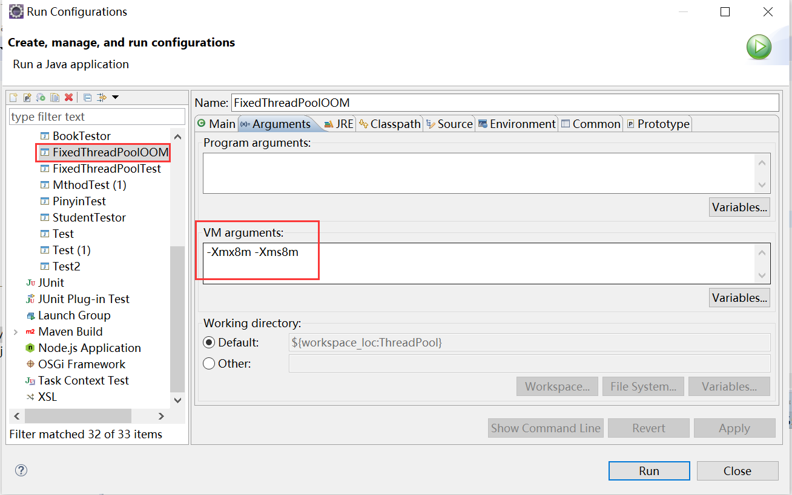

  运行程序，抛出OOM异常

  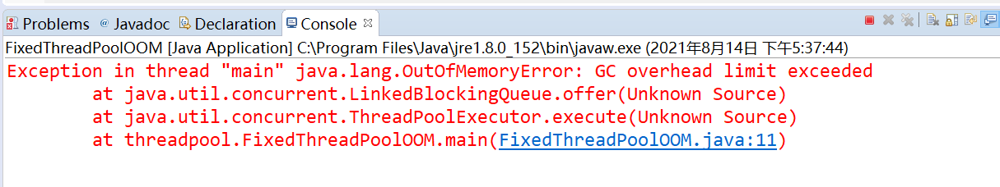

* newSingleThreadExecutor的问题：当请求堆积的时候，可能会占用大量内存

  ```java
  public class SingleThreadExecutor {
  	public static void main(String[] args) {
  		 ExecutorService  executorService = Executors.newSingleThreadExecutor();
  		 for (int i = 0; i < 100; i++) {
  			 executorService.execute(new Task()); 			
  		}
  	}
  }
  ```

* newCachedThreadPool

  特点：具有自动回收多余线程的功能

  缺点：第二个参数maxPoolSize被设置为Integer.MAX_VALUE，这可能会创建数量非常多的线程，甚至导致OOM

  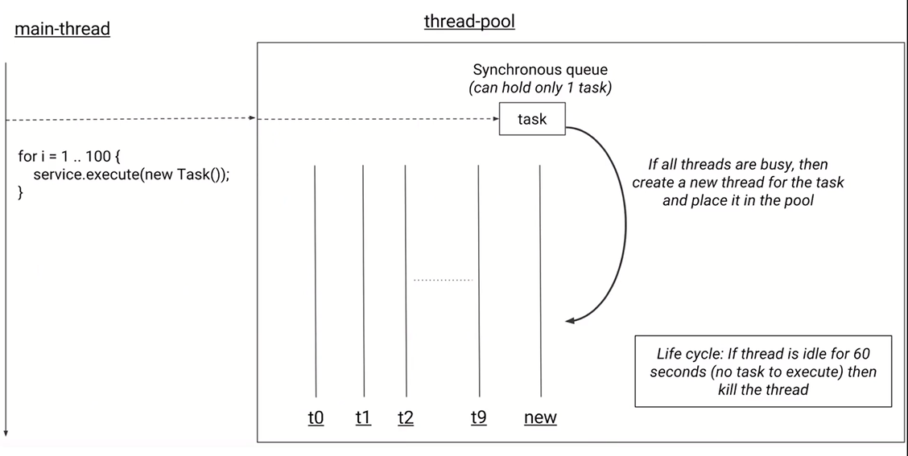

  ```java
  public class CacheThreadPool {
  
  	public static void main(String[] args) {
  		// TODO Auto-generated method stub
  		ExecutorService executorService = Executors.newCachedThreadPool();
  		for (int i = 0; i < 100; i++) {
  			executorService.execute(new Task());			
  		}
  	}
  
  }
  ```

* newScheduledThreadPool

  支持定时及周期性任务执行的线程池

  ```java
  public class ScheduleThreadPool {
  
  	public static void main(String[] args) {
  		ScheduledExecutorService scService = Executors.newScheduledThreadPool(10);
  		//延迟5s后执行任务
  //		scService.schedule(new Task(), 5, TimeUnit.SECONDS);
  		//延迟1s后，开始执行任务，每隔3s后，再次执行任务
  		scService.scheduleAtFixedRate(new Task(), 1, 3, TimeUnit.SECONDS);
  	}
  
  }
  ```

* 正确的创建线程池的方法

  * 根据不同业务场景，设置线程池参数
  * 比如：内存有多大，给线程取什么名字等等

* 线程池中的线程数量设定为多少比较合适

  * CPU密集型（加密、计算hash等）：最佳线程数为CPU核心数的1-2倍左右。

  * 耗时IO型（读写数据库、文件、网络读写等）：最佳线程数一般会大于CPU核心数很多倍。

  * 参考Brain Goetz推荐的计算方法：

    线程数=CPU核心数*（1+平均等待时间/平均工作时间）

## 线程池特点

### 4种线程池构造参数

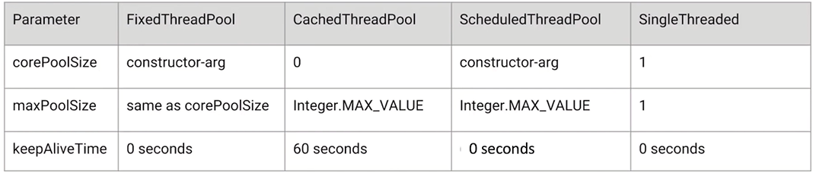

### 阻塞队列分析

* FixedThreadPool和SingleThreadExecutor的Queue是LInkedBlockingQueue

* CachedThreadPool使用的Queue是SynchronousQueue

* ScheduleThreadPool使用延迟队列DelayedWorkQueue

* workStealingPool（JDK1.8加入）

  

## 关闭线程池

### 停止线程池的正确方法

* shutdown（停止线程池，但是线程池中未完成的任务继续执行，如果加入新任务，会抛出异常）

```java
public class ShutDownTest {

	public static void main(String[] args) throws InterruptedException {
		// TODO Auto-generated method stub
		ExecutorService executorService = Executors.newFixedThreadPool(10);
		for (int i = 0; i < 500; i++) {
			executorService.execute(new ShutDownTask());
		}
		
		Thread.sleep(1500);
		//停止线程池
		executorService.shutdown();
        //当有新的任务加入时，会抛出异常
		executorService.execute(new ShutDownTask());
	}
	
}

class ShutDownTask implements Runnable{

	@Override
	public void run() {
		try {
			Thread.sleep(500);
			System.out.println(Thread.currentThread().getName());
		} catch (InterruptedException e) {
			// TODO Auto-generated catch block
			e.printStackTrace();
		}
	}
	
}
```

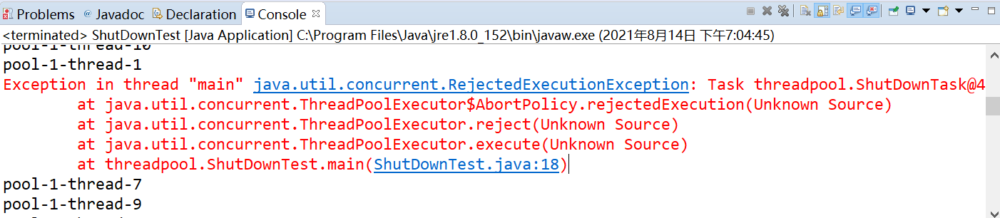

* isShutdown（检测线程池是否关闭）

  ```java
  ...
  System.out.println("before:"+executorService.isShutdown());
  //停止线程池
  executorService.shutdown();
  System.out.println("after:"+executorService.isShutdown());
  executorService.execute(new ShutDownTask());
  ...
  ```

* isTerminated（检测线程池关闭后，线程池中的任务是否都执行完毕）

  ```java
  //停止线程池
  executorService.shutdown();
  System.out.println("after:"+executorService.isShutdown());
  Thread.sleep(10000);
  System.out.println("isTerminated:"+executorService.isTerminated());
  ```

* awaitTermination（检测是否在指定时间内线程池是否关闭）

  ```java
  executorService.shutdown();
  System.out.println("after:"+executorService.isShutdown());
  System.out.println("awaitTermination:"+executorService.awaitTermination(100, TimeUnit.SECONDS));
  executorService.execute(new ShutDownTask());
  ```

* shutdownNow（关闭线程池，立刻中断所有任务）

  ```java
  ExecutorService executorService = Executors.newFixedThreadPool(10);
  for (int i = 0; i < 100; i++) {
  	executorService.execute(new ShutDownTask());
  }
  		
  Thread.sleep(1500);
  //立刻停止线程池
  executorService.shutdownNow();
  ```


### 暂停和恢复线程池 

* 拒绝时机

  1. 当Executor关闭时，提交新任务会被拒绝。

  2. 当Executor对最大线程和工作队列容量使用有限边界并且已经饱和时。

     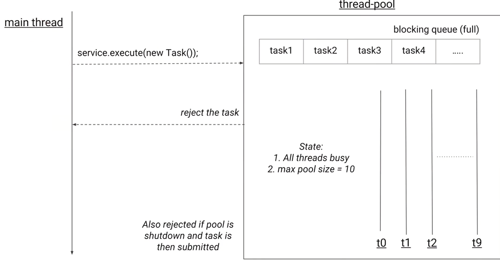

* 拒绝策略

  1. AbortPolicy，抛出异常进行拒绝
  2. DiscardPolicy，默默丢弃任务
  3. DiscardOldestPolicy，丢弃最老（存在时间最久的）的任务
  4. CallerRunsPolicy，让提交任务的线程去执行

* 钩子方法

  * 每个任务执行前后
  * 日志、统计

* 代码演示

  重写线程池执行类

  ```java
  package threadpool;
  
  import java.util.concurrent.BlockingQueue;
  import java.util.concurrent.LinkedBlockingDeque;
  import java.util.concurrent.RejectedExecutionHandler;
  import java.util.concurrent.ThreadFactory;
  import java.util.concurrent.ThreadPoolExecutor;
  import java.util.concurrent.TimeUnit;
  import java.util.concurrent.locks.Condition;
  import java.util.concurrent.locks.ReentrantLock;
  
  /**
   * 
   * 演示每个每个任务执行前后放钩子函数
   *
   */
  public class PauseableThreadPool extends ThreadPoolExecutor {
  
  	//标记位，标记线程池是否处于暂停状态
  	private boolean isPaused;
  	
  	//为了让isPaused并发修改是安全的，使用锁 
  	private final ReentrantLock lock = new ReentrantLock();
  	
  	private Condition unPaused = lock.newCondition();
  	
  	public PauseableThreadPool(int corePoolSize, int maximumPoolSize, long keepAliveTime, TimeUnit unit,
  			BlockingQueue<Runnable> workQueue) {
  		super(corePoolSize, maximumPoolSize, keepAliveTime, unit, workQueue);
  		// TODO Auto-generated constructor stub
  	}
  
  	public PauseableThreadPool(int corePoolSize, int maximumPoolSize, long keepAliveTime, TimeUnit unit,
  			BlockingQueue<Runnable> workQueue, RejectedExecutionHandler handler) {
  		super(corePoolSize, maximumPoolSize, keepAliveTime, unit, workQueue, handler);
  		// TODO Auto-generated constructor stub
  	}
  
  	public PauseableThreadPool(int corePoolSize, int maximumPoolSize, long keepAliveTime, TimeUnit unit,
  			BlockingQueue<Runnable> workQueue, ThreadFactory threadFactory, RejectedExecutionHandler handler) {
  		super(corePoolSize, maximumPoolSize, keepAliveTime, unit, workQueue, threadFactory, handler);
  		// TODO Auto-generated constructor stub
  	}
  
  	public PauseableThreadPool(int corePoolSize, int maximumPoolSize, long keepAliveTime, TimeUnit unit,
  			BlockingQueue<Runnable> workQueue, ThreadFactory threadFactory) {
  		super(corePoolSize, maximumPoolSize, keepAliveTime, unit, workQueue, threadFactory);
  		// TODO Auto-generated constructor stub
  	}
  	
  	@Override
  	protected void beforeExecute(Thread t, Runnable r) {
  		// TODO Auto-generated method stub
  		super.beforeExecute(t, r);
  		lock.lock();
  		try {
  			while(isPaused) {
  				unPaused.await();
  			}
  		}catch(InterruptedException e){
  			e.printStackTrace();
  		}finally {
  			lock.unlock();
  		}
  	}
  	
  	private void pause() {
  		lock.lock();
  		try {
  			isPaused = true;
  		}finally {
  			lock.unlock();//释放锁
  		}
  	}
  	
  	public void resume() {
  		lock.lock();
  		try {
  			isPaused = false;
  			unPaused.signalAll();
  		}finally {
  			lock.unlock();
  		}
  	}
  	
  	public static void main(String[] args) throws InterruptedException {
  		PauseableThreadPool pauseableThreadPool = 
  		new PauseableThreadPool(10, 20, 10, TimeUnit.SECONDS, new LinkedBlockingDeque<Runnable>());
  		Runnable runnable = new Runnable() {
  			
  	 		@Override
  			public void run() {
  				System.out.println("正在执行");
  				try {
  					Thread.sleep(200);
  				} catch (InterruptedException e) {
  					// TODO Auto-generated catch block
  					e.printStackTrace();
  				}
  			}
  		};
  		
  		for(int i=0; i<100; i++) {
  			pauseableThreadPool.execute(runnable);
  		}
  		
  		Thread.sleep(1500);
  		pauseableThreadPool.pause();
  		System.out.println("线程池被暂停");
  		
  		Thread.sleep(1500);
  		pauseableThreadPool.resume();
  		System.out.println("线程池恢复了");
  	}
  
  }
  ```

## 线程池实现复用的原因

### 实现原理，源码分析  

* 线程池组成部分
  * 线程池管理器
  * 工作线程
  * 任务队列
  * 任务接口（Task）

* Executor家族

  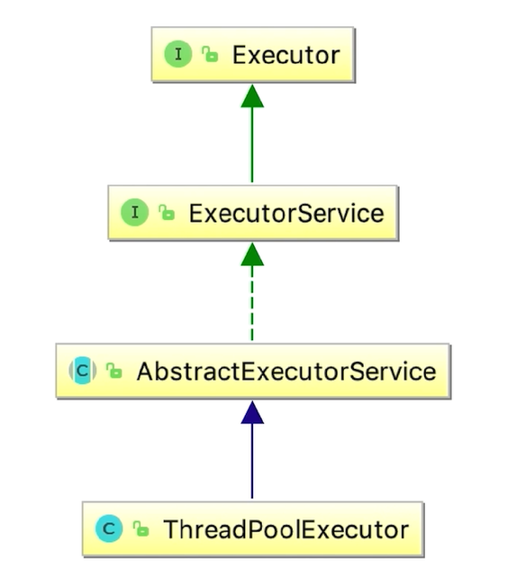

* 线程池实现任务复用原理
  * 相同线程执行不同任务
  * 源码分析

### 线程池状态

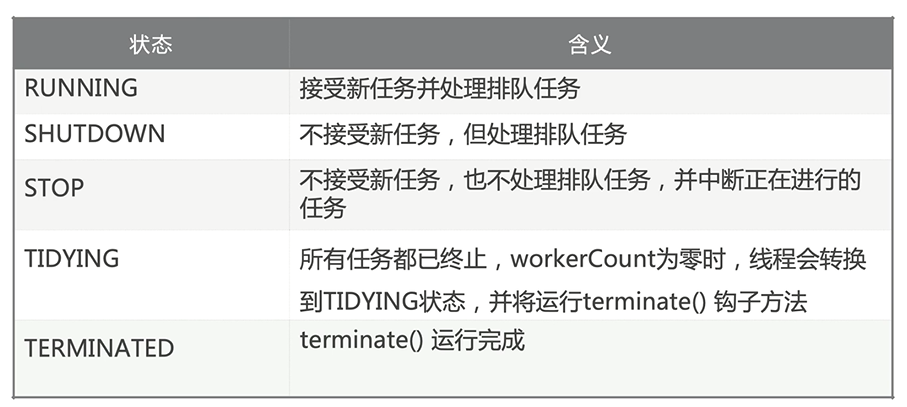

### 使用线程池的注意点

* 避免任务堆积
* 避免线程数过渡增加
* 排查线程泄露