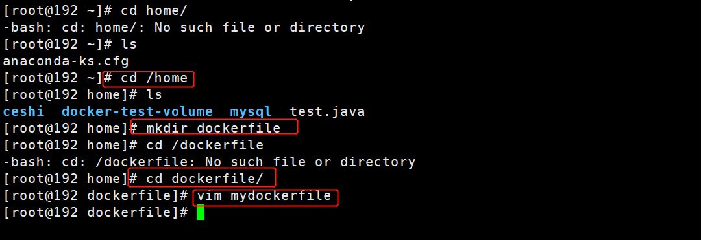
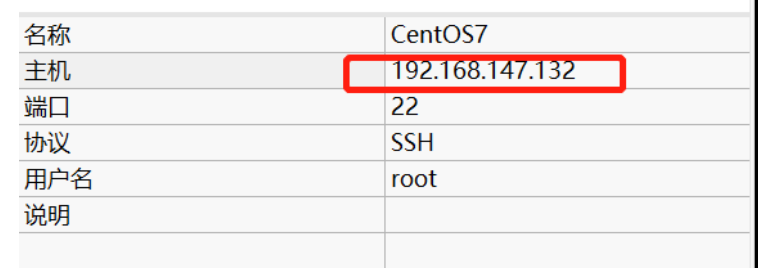

# Docker


## 参考资料

官方文档：https://docs.docker.com/docker-for-windows/ 

【官方文档超级详细】

仓库地址：https://hub.docker.com/

【发布到仓库，git pull push】


## Docker安装

```shell
#下载docker
curl -fsSL get.docker.com -o get-docker.sh
sudo sh get-docker.sh --mirror Aliyun
#启动docker
sudo systemctl enable docker
sudo systemctl start docker
#创建docker用户组
sudo groupadd docker
#将当前用户加入docker组
sudo usermod -aG docker $USER
```


### 启动Docker

```
systemctl start docker # 代表启动成功
```

```
docker version  查看版本
```

docker输出hello world

```
docker run hello-world
```


查看下载的镜像

```
docker images
```


### 卸载Docker

```
# 卸载依赖
yum remove docker-ce docker-ce-cli containerd.io

# 删除资源
rm -rf /var/lib/docker # docker 的默认工作路径

```


## 概念


### 镜像（image）

一个镜像就是一个软件 例如mysql镜像、redis镜像、mq

### 容器（container）

镜像的运行之后会生成一个容器，正在运行的镜像可写可读

### 仓库（repository）

> 本地仓库

用来存储docker使用过的相关镜像

> 远程仓库

远程仓库用来存储所有软件的镜像位置

- 设置远程阿里云镜像仓库

```bash
sudo mkdir -p /etc/docker
sudo tee /etc/docker/daemon.json <<-'EOF'
{
  "registry-mirrors": ["https://ijv3gqrm.mirror.aliyuncs.com"]
}
EOF
sudo systemctl daemon-reload
sudo systemctl restart docker
```


### Dockerfile

docker生产镜像配置文件，用来书写自定义镜像的一些配置

### tar

一个对镜像打包的文件，日后可还原成镜像


### 数据卷（volume）

- 将宿主机目录和容器内目录进行**绑定同步** 只有在创建容器的时候才可以进行绑定
- 宿主机和容器内绑定的目录都会相互影响


```dockerfile
- FROM
  FROM  镜像名:版本
基于这个镜像进行构建，必须作为Dockerfile的第一个指令出现。
- RUN
  RUN 命令
在当前工作目录下执行后面的命令
- WORKDIR
  WORKDIR 目录
相当于cd到指定目录，如果这个目录不存在，它将被创建。
且进入容器时会进入到最后指定的目录
- ENV
  ENV 变量=值
设置环境变量，用的时候这样：$变量。
- ADD
  ADD 本地文件路径/远程文件url 容器中路径    
复制本地文件或远程文件到容器指定路径的中
- CMD
  CMD 命令
指定容器启动时执行的命令，只有最后一个（所有容器Dockerfile的CMD的最后一个）才会生效。
- #
  注释
```


## 帮助命令

```bash
docker version # 显示docker的基本信息
docker info # 系统信息，镜像和容器的数量
docker 命令 --help # 全部信息
```

## 启动Docker

```
systemctl start docker # 代表启动成功
```

```
docker version  查看版本
```

docker输出hello world

```
docker run hello-world
```

[官网文档](https://docs.docker.com/reference/)


## 镜像命令

#### docker images

查看所有本地主机上的镜像

```bash
[root@192 ~]# docker images
```


```bash
--all , -a		Show all images (default hides intermediate images) # 显示所有
--digests		Show digests
--filter , -f	Filter output based on conditions provided
--format		Pretty-print images using a Go template
--no-trunc		Don’t truncate output
--quiet , -q	Only show numeric IDs # 只显示id
```


#### docker search

搜索仓库中的镜像，相当于网页搜索

```bash
docker search mysql
docker search mysql --filter=STARS=3000 # 搜索出Stars大于3000的
```


#### docker pull

下载镜像

```bash
docker pull mysql # 下载mysql镜像，default tag，默认最新版latest
docker pull mysql:5.7  #指定版本
docker pull centos  #下次centos容器
```


#### docker rmi

remove images

```bash
# 删除一个 可以通过名称 也可以指定id -f表示删除所有
docker rmi -f 9cfcce23593a
# 删除多个 用空格分隔id
docker rmi -f id id id
# 删除所有 
docker rmi -f $(docker images -aq) # images -aq就是查所有镜像id，从而递归删除
# 删除tomcat全部镜像
docker image rm -f $(docker images tomcat -q)
```


#### 备份和恢复

将镜像备份为tar压缩包可以发送给其他机器使用

- 备份

```shell
#docker save 镜像名：版本号 -o  自定义镜像名
docker save tomcat:8.0 -o zcj_tomcat.tar
```

- 恢复

恢复之后 该linux就有了此镜像可以运行

```shell
docker load -i  zcj_tomcat.tar
```


## 容器命令

### 新建容器并启动

```shell
docker run tomcat:8.0
#这种启动会运行在docker系统的端口里， 和linux的端口无法映射
#一般启动不使用这种
```

映射端口

```shell
#将docker服务的8080映射到linux的8080
docker run -p 8080:8080 tomcat:8.0

#将docker服务的8081映射到linux的8080
docker run -p 8081:8080 tomcat:8.0

#后台启动
 docker run -p 8080:8080 -d tomcat:8.0

#容器设置名称
docker run -d -p 8079:8080  --name tomcat8079 tomcat:8.0
```

### 启动、重启、停止容器

```shell
[root@192 ~]# docker stop cb6d7fbc3f27 (名称或者id)
docker start [id]
docker restart [id]
docker stop  [id] #停止（允许容器关闭后续服务）
docker kill  [id] #直接杀进程
docker pause [id] #暂停
docker unpause [id]  #取消暂停
```

### 查看运行的容器

```bash
# 查看正在运行的容器
docker ps
# 查看曾经运行的容器
docker ps -a
# 显示最近创建的容器，设置显示个数
docker ps -a -n=? 
# 只显示容器的编号
docker ps -aq
```

### 删除容器

```shell
# 删除指定容器 不能删除正在运行的容器，如果强制删除 rm -f
docker rm 容器id
# 删除所有容器
docker rm -f $(docker ps -aq)
# 删除所有容器
docker ps -a -q|xargs docker rm
```


### 进入退出容器

```bash
# 进入
docker run -it [id] bash
# 查看目录
ls
# 退出
exit
```

### 进入当前正在运行的容器

```shell
# 方式一
docker exec -it 容器id bashSHELL
[root@192 ~]# docker exec -it c2887d35c71d /bin/bash
			docker exec -it tomcat01 /bin/bash

# 方式二
[root@192 ~]# docker attach c2887d35c71d

```

> 区别
> docker exec # 进入容器后开启一个新的终端，可以在里面操作(常用)
> docker attach 进入容器正在执行的终端，不会启动新的进程


### 容器和主机 文件拷贝

```shell
# 将容器里位于/home的文件   拷贝到主机的/home中
docker cp 0569081aa89c:/home/test.java /home

# 将主机里的文件拷贝到 容器中
docker cp 8899.log d648c9a76eea:/usr/local/tomcat
```


### 查看日志

```shell
docker logs [id]
docker logs -t [id] #显示时间
docker logs -f [id] #实现监控
docker logs -f -t --tail n [id] #展示多少行
```

### 查看容器中进程

```shell
docker top [id]
docker inspect [id] #查看容器细节
```

### 查看内容占用

```shell
docker stats
```


### 容器数据卷

#### 什么是容器卷

- 将宿主机目录和容器内目录进行**绑定同步** 只有在创建容器的时候才可以进行绑定
- 宿主机和容器内绑定的目录都会相互影响


#### 使用数据卷

- 直接使用命令来挂载

```shell
# -v 主机目录：容器目录
docker run -d -p 8080:8080  --name tomcat8080 -v /work/docker/file:/usr/loacl/tomcat/webapps tomcat:8.0
```

将容器内的目录设置为只读

```shell
# -v 主机目录：容器目录:ro
docker run -d -p 8080:8080  --name tomcat8080 -v /work/docker/file:/usr/loacl/tomcat/webapps:ro tomcat:8.0
```

使用别名设置数据卷

```shell
#使用tomcat8078作为别名目录 和容器内的目录进行绑定
docker run -d -p 8078:8080  --name tomcat8078 -v tomcat8078:/usr/loacl/tomcat/webapps tomcat:8.0
```

- 别名创建会自动创建目录，并将这个别名目录默认存储在**/var/lib/docker/volumes/**下


### 容器打包为新的镜像


可以将自己设置好的容器打包为新的镜像

```shell
docker commit -m "描述" [id/name] -a "作者"  镜像名：版本

docker commit -m "tomcat8080_zcj" -a "zcj" e3ca70741122 tomcat:8.0
```


## 安装mysql

MySQL的数据持久化命令

```shell
docker pull mysql:5.6
#运行 设置密码 映射端口 保存数据
docker run -p 3305:3306 -e MYSQL_ROOT_PASSWORD=123456 -d --name mysql_3305 --restart=always -v /root/data:/var/lib/mysql mysql:5.6

-d 后台运行
-p 端口映射
-v 卷挂载
-e 环境配置 安装启动mysql需要配置密码
--name 容器名字
--restart=always   docker启动时 便启动该容器

```


## 安装redis

```shell
docker pull redis:5.0.12

#设置参数
docker run --name redis6379 -d -p 6379:6379  --restart=always -v /root/redisdata:/data redis:5.0.12 redis-server --appendonly yes --requirepass ZCJzcj4068321

--restart=always #docker自动重启
-v #数据绑定
--appendonly yes #设置aof
--requirepass ZCJzcj4068321  #设置密码

#读取配置文件
docker run --name redis6379 -d -p 6379:6379  --restart=always -v /root/redisdata:/data redis:5.0.12 redis-server /data/redis.conf
```


## 安装Nginx

```shell
docker run --name my-custom-nginx-container -v /host/path/nginx.conf:/etc/nginx/nginx.conf:ro -d nginx
```


## DockerFile

是用来构建docker镜像的文件，可以理解为命令参数脚本

构建步骤：

1. 编写一个dockerfile文件
2. docker build 构建成为一个镜像
3. docker run运行镜像
4. docker push 发布镜像（DockerHub、阿里云镜像仓库 私有/共有）

这个写一个项目时一样的

### 官方DockerFile示例

看一下官方的DockerFile


可以看到官方镜像都是基础包，很多功能没有，我们通常会自己搭建自己的镜像

官方既然可以制作镜像，我们亦可以

-----

### DockerFile基础知识

1. 每个指令都必须是大写字母
2. 按照从上到下顺序执行
3.  *#*表示注释
4. 每一个指令都会创建体检一个新的镜像层，并提交


docker是面向开发的，我们以后要发布项目，做镜像，就要编写dockerfile文件，这个文件十分简单！

Docker镜像逐渐成为企业的交付标准，必须掌握！

---

### DockerFile命令


### 

```shell
FROM # 基础镜像 比如centos
MAINTAINER # 镜像是谁写的 姓名+邮箱
RUN # 镜像构建时需要运行的命令
ADD # 添加，比如添加一个tomcat压缩包
WORKDIR # 镜像的工作目录
VOLUME # 挂载的目录
EXPOSE # 指定暴露端口，跟-p一个道理
RUN # 最终要运行的
CMD # 指定这个容器启动的时候要运行的命令，只有最后一个会生效，而且可被替代
ENTRYPOINT # 指定这个容器启动的时候要运行的命令，可以追加命令
ONBUILD # 当构建一个被继承Dockerfile 这个时候运行ONBUILD指定，触发指令
COPY # 将文件拷贝到镜像中
ENV # 构建的时候设置环境变量
```

### 实战构建自己的centos

Docker Hub中99%的镜像都是从FROM scratch开始的

添加centos7的压缩包

```shell
# 创建一个自己的centos

# 进入home目录
cd /home

# 创建一个目录，之后的东西都保存到这里
mkdir dockerfile
# 进入这个目录
cd dockerfile/
# 创建一个dockerfile，名字叫mydockerfile
vim mydockerfile-centos
```

xshell新开一个界面

```shell
# 官方默认centos
docker run -it centos
pwd # 官方默认有pwd命令
vim # 官方默认没有vim命令
ifconfig # 官方默认没有ifconfig命令
```


回到mydockerfile



```shell
# 下面给官方centos加上自定义的内容
FROM centos
MAINTAINER padaxing<010301200@hai.com>

ENV MYPATH /usr/local
WORKDIR $MYPATH

RUN yum -y install vim
RUN yum -y install net-tools

EXPOSE 80

CMD echo $MYPATH
CMD echo "---end---"
CMD /bin/bash
```


ESC, shif + : 输入wq保存并退出

如果写错了需要修改、

```shell
vim mydockerfile-centos
# 进入之后按i或者INSERT键即可修改
```


下面通过这个这个文件创建镜像

```shell
docker build -f dockerfile-centos -t mycentos:0.1 .
```


依次执行命令


最终返回Successfully表示成功


```shell
docker run -it mycentos:0.1 # 版本号必须写，不然他会去找最新的
pwd
vim
ifconfig
```


这时可以看到这些功能都有了

可以通过查看docker构建历史


可以看到当前这个镜像是怎么一步一步构建起来的

我们平时拿到一个镜像也可以通过这个方法研究一下他是怎么做的

### CMD与ENTRYPOINT

【视频书签，https://www.bilibili.com/video/BV1og4y1q7M4?p=29，雨终于停了，想去江边跑步】

```shell

FROM centos
CMD ["ls","-a"] # 启动centos展示目录
```


测试ENTRYPOINT


run的时候可以直接加命令


Docker中许多命令都十分相似，我们需要了解他们的区别，最好的方式就是这样对比测试

---

### 实战Tomcat镜像

【视频书签，https://www.bilibili.com/video/BV1og4y1q7M4?p=30，这节有点长，这个jar包是哪来的，晚上再搞，先去该模型比较急，还有10节课，这周争取都看完】

1. 准备镜像文件 tomcat压缩包
2. 

## IDEA整合Docker

## Docker 整合Docker

## Docker Compose

## Docker Swarm

## 各种bug

### Xshell链接失败


```bash
Connecting to 192.168.147.131:22...
Could not connect to '192.168.147.131' (port 22): Connection failed.

```


注：电脑休眠重启后，机子会断开，要重新在vmware里面输入ip addr 获得ip


修改xshell中的主机接口即可

![image-20200616200505065](Docker.assets/image-20200616200505065.png

