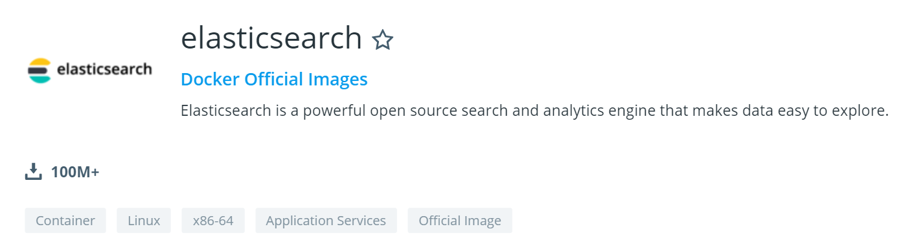
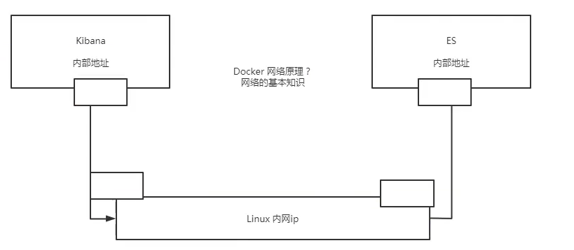
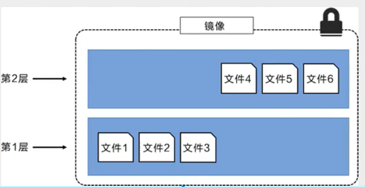
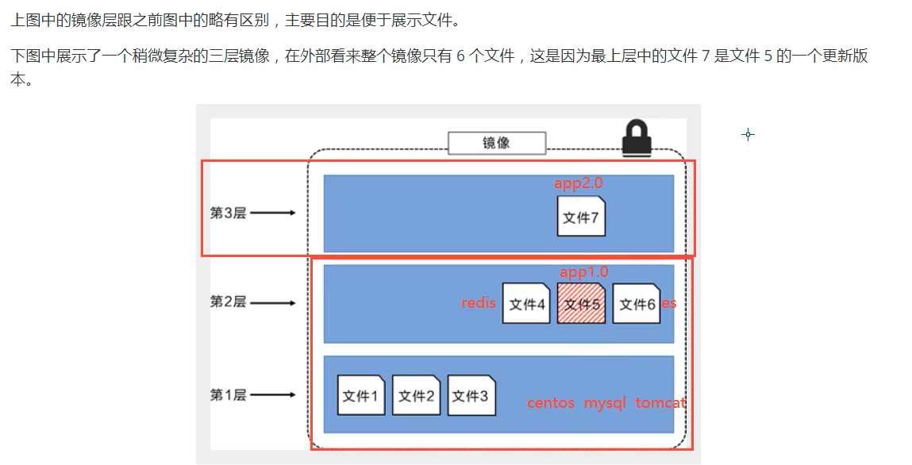
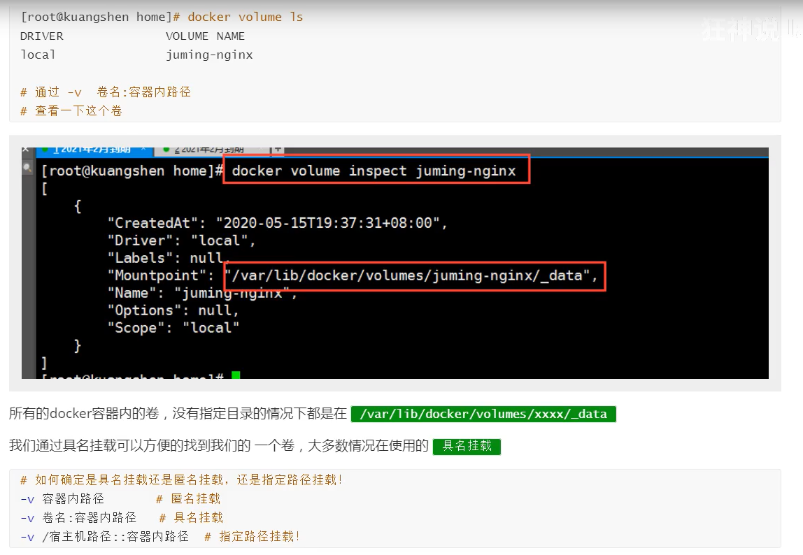
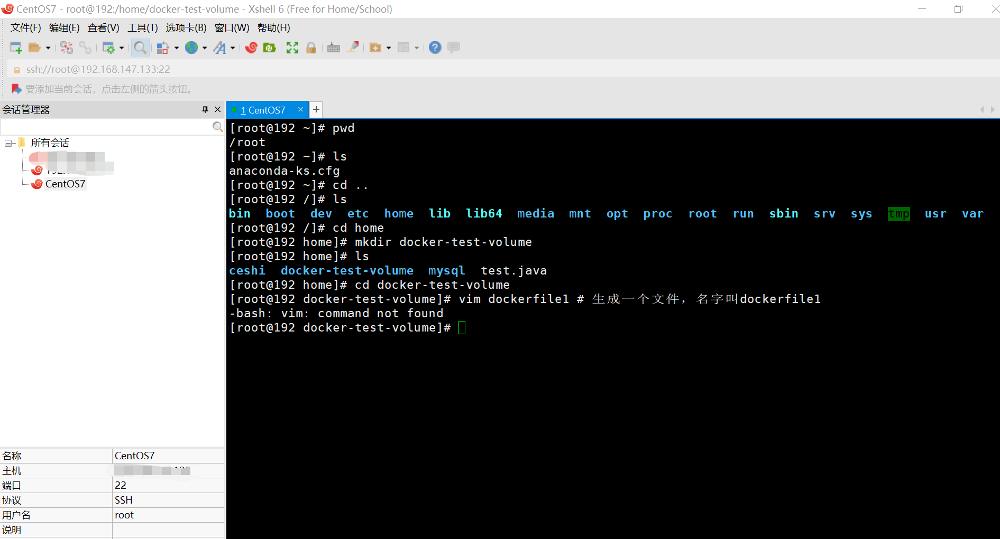
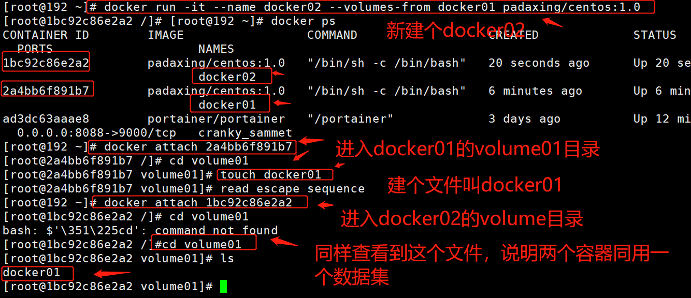
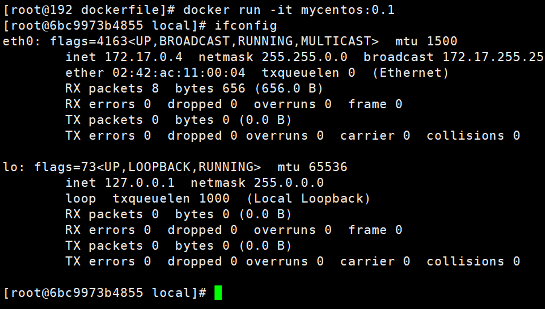
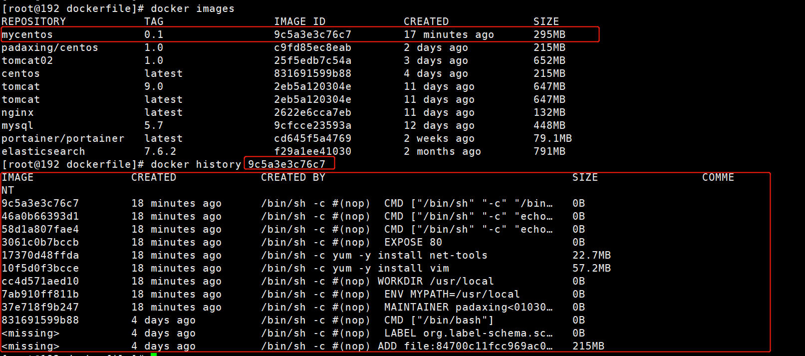

# Docker


## 参考资料

官方文档：https://docs.docker.com/docker-for-windows/ 

【官方文档超级详细】

仓库地址：https://hub.docker.com/

【发布到仓库，git pull push】


## Docker概述

### Docker为什么会出现

一款产品，开发和上线两套环境，应用环境配置费时费力，而且容易出问题

尤其对于机器学习和深度学习的库更是如此，很可能存在版本问题、底层依赖冲突问题

所以发布项目时，不只是一套代码过去，而是代码+环境整体打包过去

所谓开发即运维，保证系统稳定性，提高部署效率

使用Docker后的流程：

开发：建立模型--环境--打包带上环境，即镜像--放到Docker仓库

部署：下载Docker中的镜像，直接运行即可


Docker的思想来自于集装箱，集装箱，对环境进行隔离

Docker通过隔离机制，可以将服务器利用到极致。


### 容器vs虚拟机

在容器技术出来之前，用的是虚拟机技术

#### 虚拟机原理示意图


缺点：

1. 资源占用多
2. 冗余步骤多
3. 启动很慢

#### 容器化技术示意图

不是模拟的完整的操作系统


#### 二者对比

比较虚拟机和Docker的不同

|          | 传统虚拟机               | Docker        |
| -------- | ------------------------ | ------------- |
| 虚拟内容 | 硬件+完整的操作系统+软件 | APP+LIB       |
| 大小     | 笨重，通常几个G          | 轻便几个M或KB |
| 启动速度 | 慢，分钟级               | 快，秒级      |
|          |                          |               |


## Docker安装

### Docker的基本组成


明确几个概念：

1. 镜像(image)：docker镜像好比一个模板，可以通过这个模板来创建容器(container)，一个镜像可以创建多个容器，类似Python中的Class

2. 容器(container)：类似Python中通过Class创建的实例，Object；容器可以理解为一个简易的系统

3. 仓库(repository)：存放镜像的地方，

   分为共有仓库和私有仓库

   - Docker Hub：国外的
- 阿里云：配置镜像加速


### 环境准备

我们要有一台服务器，并且可以操作它

1. Linux命令基础，购买linux阿里云的服务器
2. CentOS 7
3. 使用Xshell链接远程服务器

### 安装xshell

下载CentOS7 https://www.jianshu.com/p/a63f47e096e8

下载VMware 360软件管家下载

VMware配置虚拟机 https://blog.csdn.net/babyxue/article/details/80970526

xshell链接服务器 https://blog.csdn.net/zzy1078689276/article/details/77280814

```
[root@192 ~]# cd /
[root@192 /]# pwd
/
[root@192 /]# ls
bin  boot  dev  etc  home  lib  lib64  media  mnt  opt  proc  root  run  sbin  srv  sys  tmp  usr  var
[root@192 /]# uname -r
3.10.0-1127.el7.x86_64
```


### 安装基本环境

```
# 安装基本的安装包
$ sudo yum install -y yum-utils
```


### 设置镜像的仓库

注意！！下载默认用国外的，太慢不要用！

用国内镜像，百度搜索，docker的阿里云镜像地址

```
# 不要用官网默认这个！
$ sudo yum-config-manager \
    --add-repo \
    https://download.docker.com/linux/centos/docker-ce.repo # 默认是国外的

# 换成下面的

$ sudo yum-config-manager \
    --add-repo \
    https://mirrors.aliyun.com/docker-ce/linux/centos/docker-ce.repo # 阿里云镜像
```

更像软件包索引

```
yum makecache fast
```

没有问题的话就是可以用的

### 安装docker引擎

```python
yum install docker-ce docker-ce-cli containerd.io # docker-ce 社区版 ee 企业版
```


### 启动Docker

```
systemctl start docker # 代表启动成功
```

```
docker version  查看版本
```

docker输出hello world

```
docker run hello-world
```


中间一堆是签名信息

run的运行流程图


查看下载的镜像

```
docker images
```


### 卸载Docker

```
# 卸载依赖
yum remove docker-ce docker-ce-cli containerd.io

# 删除资源
rm -rf /var/lib/docker # docker 的默认工作路径

```


## 底层原理

Docker是怎么工作的？


Docker是一个Client-Server结构的系统，Docker的守护进程在主机上。通过Socket从客户端访问！

DockerServer接受到Docker-Client的指令，


Docker为什么比VM快？

1. Docker有着比虚拟机更少的抽象层
2. docker主要用的是宿主机的内核，vm需要Guest OS


所以说新建一个容器的时候，docker不需要像虚拟机一样重新加载一个操作系统内核，避免引导


## Docker命令

### 帮助命令

```bash
docker version # 显示docker的基本信息
docker info # 系统信息，镜像和容器的数量
docker 命令 --help # 全部信息
```

### 启动Docker

```
systemctl start docker # 代表启动成功
```

```
docker version  查看版本
```

docker输出hello world

```
docker run hello-world
```

[官网文档](https://docs.docker.com/reference/)


### 镜像命令

#### docker images

查看所有本地主机上的镜像

```bash
[root@192 ~]# docker images
```


```bash
--all , -a		Show all images (default hides intermediate images) # 显示所有
--digests		Show digests
--filter , -f	Filter output based on conditions provided
--format		Pretty-print images using a Go template
--no-trunc		Don’t truncate output
--quiet , -q	Only show numeric IDs # 只显示id
```


#### docker search

搜索仓库中的镜像，相当于网页搜索

```bash
docker search mysql
docker search mysql --filter=STARS=3000 # 搜索出Stars大于3000的
```


#### docker pull

下载镜像

```bash
docker pull mysql # 下载mysql镜像，default tag，默认最新版latest
docker pull mysql:5.7  #指定版本
docker pull centos  #下次centos容器
```


#### docker rmi

remove images

```bash
# 删除一个 可以通过名称 也可以指定id -f表示删除所有
docker rmi -f 9cfcce23593a
# 删除多个 用空格分隔id
docker rmi -f id id id
# 删除所有 
docker rmi -f $(docker images -aq) # images -aq就是查所有镜像id，从而递归删除
```


### 容器命令

#### 新建容器并启动

```shell
docker run [可选参数] image
docker run -it -p 3355:8080 tomcat1.0

# 参数说明
--name=“Name” # 容器名字，用于区分容器
-d 后台方式运行
-it 使用交互方式运行，进入容器查看内容
-p 指定容器的端口 如-p 8080::8080
	-p ip:主机端口：容器端口
	-p 主机端口:容器端口
	-p 容器端口
	
-p 随机指定端口
```


#### 进入退出容器

```bash
# 进入
docker run -it centos /bin/bash 
#进入nginx
docker exec -it nginx01 /bin/bash
# 查看目录
ls
# 退出
exit
```


#### 查看运行的容器

```bash
# 查看正在运行的容器
docker ps
# 查看曾经运行的容器
docker ps -a
# 显示最近创建的容器，设置显示个数
docker ps -a -n=? 
# 只显示容器的编号
docker ps -aq
```


#### 退出容器

```shell
# 容器停止退出
exit
# 容器不停止退出 注意必须在英文输入法下，中文输入法不行
Ctrl + P + Q
```

#### 进入当前正在运行的容器

```shell
# 方式一
docker exec -it 容器id bashSHELL
[root@192 ~]# docker exec -it c2887d35c71d /bin/bash
			docker exec -it tomcat01 /bin/bash

# 方式二
[root@192 ~]# docker attach c2887d35c71d

```

> 区别
> docker exec # 进入容器后开启一个新的终端，可以在里面操作(常用)
> docker attach 进入容器正在执行的终端，不会启动新的进程

#### 删除容器

```shell
# 删除指定容器 不能删除正在运行的容器，如果强制删除 rm -f
docker rm 容器id
# 删除所有容器
docker rm -f $(docker ps -aq)
# 删除所有容器
docker ps -a -q|xargs docker rm
```


#### 启动和停止容器的操作

```shell
[root@192 ~]# docker stop cb6d7fbc3f27
docker start 
docker restart 
docker stop  [id]
docker kill  [id]
```


### 常用其他命令

#### 后台启动docker

```shell
docker run -d 镜像名
# 用docker ps 查看的时候 发现停止了
```

后台运行，docker发现前台进程没有，容器启动后，发现自己没有提供服务，会立刻停止


#### 查看日志

```shell
docker logs
docker logs -f -t --tail n 【id】
```

**查看容器中进程**

```ba
docker top c97dd4770c25
```


#### 从容器内拷贝文件到主机上

```shell
# 容器数据拷贝到主机
[root@192 home]# docker cp 0569081aa89c:/home/test.java /home
```

将容器里位于/home的文件   拷贝到主机的/home中

#### 查看内容占用

```shell
docker stats
```


### 部署

#### 部署Nginx

```shell
# 下载镜像
[root@192 home]# docker pull nginx

# 查看镜像
[root@192 home]# docker images

# 运行测试
# -d 后台运行，--name 命名，-p 暴露端口，3344服务器、宿主机的端口，容器内部端口
[root@192 home]# docker run -d --name nginx01 -p:3344:80 nginx

# 使用3344可以访问成功
[root@192 home]# curl localhost:3344
```

端口暴露


#### 部署tomcat

###### 官方方法

```shell
docker run -it --rm tomcat:9.0
```

可以看到并没有tomcat，印证阅后即焚模式，容器会删除，镜像不会删除

###### 正常方法

```shell
docker pull tomcat:9.0 # 之前下过了，应该不用下了，这里老师讲错了
```

运行

```shell
# 启动运行，应该加上版本号
docker run -d -p 3355:8080 --name tomcat01 tomcat
```

```shell
# 进入容器
docker exec -it tomcat01 /bin/bash
```


发现问题

1. linux命令少了
2. 没有webapps

这是阿里云镜像的原因：默认使用最小镜像，所有不必要的都剔除了，保证最小可运行环境

```bash
#将web.dist  复制到webapps中
cp -r webapps.dist/* webapps
```


#### 部署es+kibana




```shell
# es 暴露的端口很多
# es 十分耗内存
# es 的数据一般需要放置到安全目录！挂载

# 启动 elasticsearch
$ docker run -d --name elasticsearch01 -p 9200:9200 -p 9300:9300 -e "discovery.type=single-node" elasticsearch:7.6.2

# 查看内存占用情况
docker stats
```


```shell
# 先感觉stop一下
docker stop ba18713ca536
```


```shell
# 通过 -e 限制内存
$ docker run -d --name elasticsearch02 -p 9200:9200 -p 9300:9300 -e "discovery.type=single-node" -e ES_JAVA_OPTS=“-Xms64m -Xmx512m” elasticsearch:7.6.2
```


没成功啊，SEI能告诉我为啥！！

```shell
docker run -d --name elasticsearch02 -p 9200:9200 -p 9300:9300 -e "discovery.type=single-node" -e ES_JAVA_OPTS="-Xms64m -Xmx512m" elasticsearch:7.6.2
```

>py0003null大佬:
>“ES_JAVA_OPTS=-Xms64m -Xmx512m” 
>
>py0003null大佬:
>引号提前试试

原因是引号！！你没觉得怪怪的嘛


此时查看stats，发现内存占用在控制范围内


ctrl + C退出，记得stop


#### 思考：用kibana链接elasticsearch




### 可视化

- portainer(先用这个)
- Rancher(CI/CD时用)

#### portainer

Docker图像化界面管理工具，提供一个后台面板供我们操作！

```shell
docker run -d -p 8088:9000 --restart=always -v /var/run/docker.sock:/var/run/docker --privileged=true portainer/portainer
```


## Docker镜像

### 原理

UnionFS 联合文件系统


bootfs：boot file system

rootfs：root file system







Docker镜像都是只读的，当容器启动时，一个新的可写层被加到镜像的顶部，这一层就是我们通常说的容器层，容器层之下的都叫镜像层


### commit提交镜像

将配置好的镜像提交

```shell
docker commit # 提交容器成为一个新的副本
docker commit -m="提交的描述信息" -a="作者" 容器id 目标镜像名：[TAG]
docker commit -a="zcj" -m="add webapps" b0db242f60c4 tomcat1.0
```


## 容器数据卷

### 什么是容器卷

docker是要将应用和环境打包成一个镜像

这样，数据就不应该在容器中，否则容器删除，数据就会丢失，这就是删库跑路

故容器之间要有一个数据共享技术

在Docker容器中产生的数据，同步到本地，这就是卷技术

本质上是一个目录挂载，将容器内的目录挂载到虚拟机上

目的：容器的持久化和同步操作

容器间可以数据共享


### 使用数据卷

方式一：直接使用命令来挂载

```shell
docker run -it -v -p
# -it 交互式进入
# -v volume卷技术
# -p 主机端口
docker run -it -v /home/test:/home centos /bin/bash
```


找到挂载信息Mounts


测试


容器停止后，修改主机文件，再启动容器的时候，数据同样改变

双向同步


### 实战安装mysql

MySQL的数据持久化命令

```shell
docker search mysql

# 拉取
docker pull mysql:5.7

# 挂载
docker run -d -p 3310:3306 -v /home/mysql/conf:/etc/mysql/conf.d -v /home/mysql/data:/var/lib/mysql -e MYSQL_ROOT_PASSWORD=123456 --name mysql01 mysql:5.7

-d 后台运行
-p 端口映射
-v 卷挂载
-e 环境配置 安装启动mysql需要配置密码
--name 容器名字

```

链接测试：打开SQLyog


### 具名和匿名挂载




DockerFile使用来构建docker镜像的文件



> kas:
> 没有安装吧？
>
> kas:
> 安装一下就可以了
>
> py9001021曾叙坚:
> centos 默认使用vi写内容，vim需要下载
>
> py9001021曾叙坚:
> 是的，需要下载vim才能使用
>
> YF:
> 配置可以改下，字体就很炫酷了
>
> 都建民:
> 用vi  试试
>
> 都建民:
> 你没有安装vim
>
> 都建民:
> yum install vim
>
> 都建民:
> 试试这个命令

```shell
yum install vim # 编辑文件的，没有装一下
```


安装完之后就可以运行这个命令了


```shell
# 镜像是一层一层的，脚本是一行一行的
# 指令都是大写的
# 这里的每个命令可以理解为镜像的一层

FROM centos

VOLUME ["volume01","volume02"] # 再创建镜像的时候就挂载出来

CMD echo "---end---"
CMD /bin/bash

```


想保存并退出

>Wesley.:
>shift  加  冒号


```shell
cat dockerfile1

docker build -f dockerfile1 -t padaxing/centos:1.0 .  # 最后的点很重要 镜像名不能有/
```


```shell
docker images
```


启动生成的镜像


在容器内部创建一个文件


查看Mounts，Source对应容器外目录，匿名挂载卷


测试一下，在container volume01下生成文件


在主机挂载路径下，也同样生成

### 多个容器数据共享

【视频书签：https://www.bilibili.com/video/BV1og4y1q7M4?p=25，周日下午，滨江，大雨，本来说这周六刷完的，发现周六啥也干不下去，除了吃就是睡，要么发呆研究小金库】


看一下有啥images


启动docker01，用之前建的padaxing/centos 1.0  镜像

```shell
docker run -it --name docker01 padaxing/centos:1.0 # 1.0必须写
```


当前这个ctrl+p+q不停止退出


依次启动docker02、docker03

```shell
docker run -it --name docker02 --volumes-from docker01 padaxing/centos:1.0
```

docker02继承docker01的volumes

可以验证，在docker01下加一个数据，在docker02下也会出现



创建docker03，同样继承docker01

```shell
docker run -it --name docker03 --volumes-from docker01 padaxing/centos:1.0
```


在docker03的volume01下建立文件，在docker01的volume01下同样也有

即通过--volumes-from 可以实现不同容器间的数据共享

删除docker01，数据还在

```shell
docker rm -f 
```


可以看到，删除docker01，进入docker02，数据依然在

结论：

容器之间配置信息的传递，数据卷容器的生命周期一直持续到没有容器使用位置

但是如果持久化到了本地，即使所有容器删除了，本地数据是不会删除的

------


## DockerFile

是用来构建docker镜像的文件，可以理解为命令参数脚本

构建步骤：

1. 编写一个dockerfile文件
2. docker build 构建成为一个镜像
3. docker run运行镜像
4. docker push 发布镜像（DockerHub、阿里云镜像仓库 私有/共有）

这个写一个项目时一样的

### 官方DockerFile示例

看一下官方的DockerFile


可以看到官方镜像都是基础包，很多功能没有，我们通常会自己搭建自己的镜像

官方既然可以制作镜像，我们亦可以

-----

### DockerFile基础知识

1. 每个指令都必须是大写字母
2. 按照从上到下顺序执行
3.  *#*表示注释
4. 每一个指令都会创建体检一个新的镜像层，并提交


docker是面向开发的，我们以后要发布项目，做镜像，就要编写dockerfile文件，这个文件十分简单！

Docker镜像逐渐成为企业的交付标准，必须掌握！

---

### DockerFile命令


### 

```shell
FROM # 基础镜像 比如centos
MAINTAINER # 镜像是谁写的 姓名+邮箱
RUN # 镜像构建时需要运行的命令
ADD # 添加，比如添加一个tomcat压缩包
WORKDIR # 镜像的工作目录
VOLUME # 挂载的目录
EXPOSE # 指定暴露端口，跟-p一个道理
RUN # 最终要运行的
CMD # 指定这个容器启动的时候要运行的命令，只有最后一个会生效，而且可被替代
ENTRYPOINT # 指定这个容器启动的时候要运行的命令，可以追加命令
ONBUILD # 当构建一个被继承Dockerfile 这个时候运行ONBUILD指定，触发指令
COPY # 将文件拷贝到镜像中
ENV # 构建的时候设置环境变量
```

### 实战构建自己的centos

Docker Hub中99%的镜像都是从FROM scratch开始的

添加centos7的压缩包

```shell
# 创建一个自己的centos

# 进入home目录
cd /home

# 创建一个目录，之后的东西都保存到这里
mkdir dockerfile
# 进入这个目录
cd dockerfile/
# 创建一个dockerfile，名字叫mydockerfile
vim mydockerfile-centos
```

xshell新开一个界面

```shell
# 官方默认centos
docker run -it centos
pwd # 官方默认有pwd命令
vim # 官方默认没有vim命令
ifconfig # 官方默认没有ifconfig命令
```


回到mydockerfile


```shell
# 下面给官方centos加上自定义的内容
FROM centos
MAINTAINER padaxing<010301200@hai.com>

ENV MYPATH /usr/local
WORKDIR $MYPATH

RUN yum -y install vim
RUN yum -y install net-tools

EXPOSE 80

CMD echo $MYPATH
CMD echo "---end---"
CMD /bin/bash
```


ESC, shif + : 输入wq保存并退出

如果写错了需要修改、

```shell
vim mydockerfile-centos
# 进入之后按i或者INSERT键即可修改
```


下面通过这个这个文件创建镜像

```shell
docker build -f dockerfile-centos -t mycentos:0.1 .
```


依次执行命令


最终返回Successfully表示成功


```shell
docker run -it mycentos:0.1 # 版本号必须写，不然他会去找最新的
pwd
vim
ifconfig
```



这时可以看到这些功能都有了

可以通过查看docker构建历史



可以看到当前这个镜像是怎么一步一步构建起来的

我们平时拿到一个镜像也可以通过这个方法研究一下他是怎么做的

### CMD与ENTRYPOINT

【视频书签，https://www.bilibili.com/video/BV1og4y1q7M4?p=29，雨终于停了，想去江边跑步】

```shell

FROM centos
CMD ["ls","-a"] # 启动centos展示目录
```


测试ENTRYPOINT


run的时候可以直接加命令


Docker中许多命令都十分相似，我们需要了解他们的区别，最好的方式就是这样对比测试

---

### 实战Tomcat镜像

【视频书签，https://www.bilibili.com/video/BV1og4y1q7M4?p=30，这节有点长，这个jar包是哪来的，晚上再搞，先去该模型比较急，还有10节课，这周争取都看完】

1. 准备镜像文件 tomcat压缩包
2. 

## IDEA整合Docker

## Docker 整合Docker

## Docker Compose

## Docker Swarm

## 各种bug

### Xshell链接失败


```bash
Connecting to 192.168.147.131:22...
Could not connect to '192.168.147.131' (port 22): Connection failed.

```


注：电脑休眠重启后，机子会断开，要重新在vmware里面输入ip addr 获得ip


修改xshell中的主机接口即可

