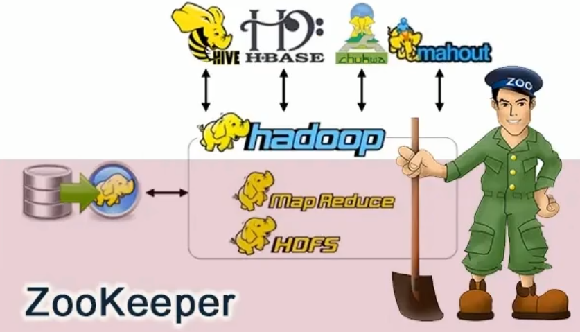
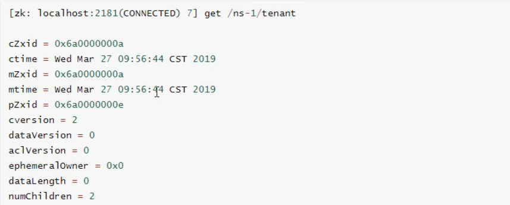
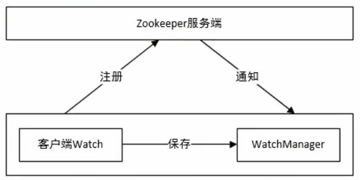
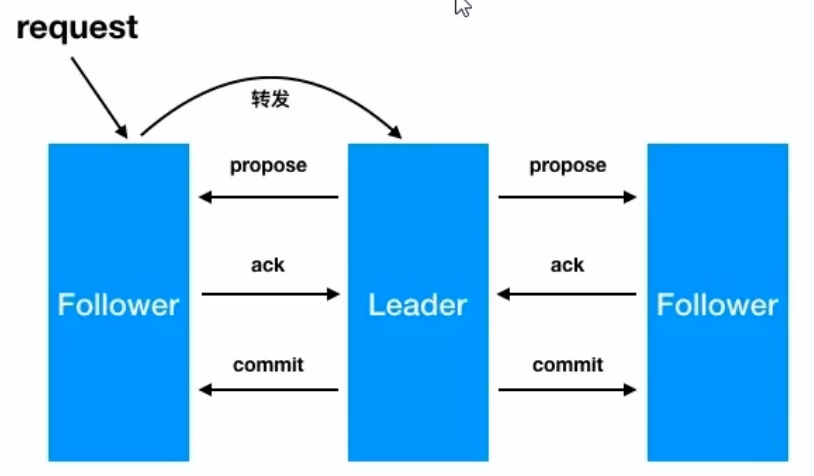
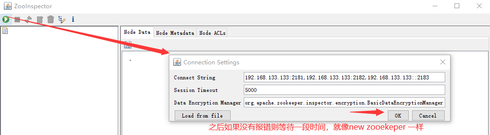
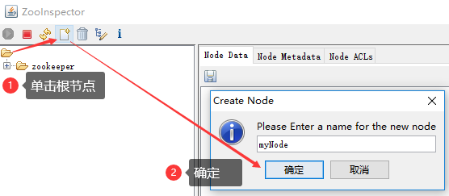
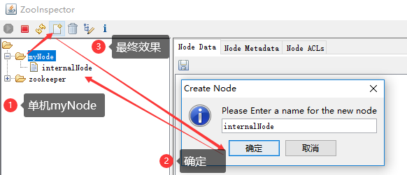
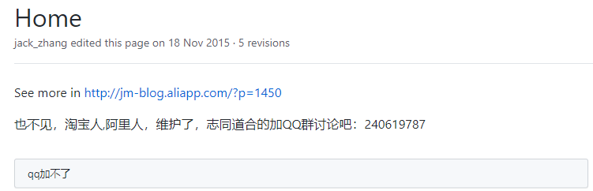

# Zookeeper

## 简介

```
ZooKeeper is a centralized service for maintaining configuration information, naming, providing distributed synchronization, and providing group services. All of these kinds of services are used in some form or another by distributed applications. Each time they are implemented there is a lot of work that goes into fixing the bugs and race conditions that are inevitable. Because of the difficulty of implementing these kinds of services, applications initially usually skimp on them, which make them brittle in the presence of change and difficult to manage. Even when done correctly, different implementations of these services lead to management complexity when the applications are deployed.
```

`ZooKeeper`是一个集中的服务，用于维护配置信息、命名、提供分布式同步和提供组服务。




### 应用场景

**zookeepepr**是一个经典的**分布式**数据一致性解决方案，致力于为分布式应用提供一个高性能、高可用,且具有严格顺序访问控制能力的分布式协调存储服务。

- 维护配置信息
- 分布式锁服务
- 集群管理
- 生成分布式唯一ID


### 数据模型

`zookeeper`的数据节点可以视为**树状结构**(或目录)，树中的各个节点被称为`znode `(即`zookeeper node`)，一个`znode`可以由多个子节点。`zookeeper`节点在结构上表现为树状；

znode 存储的数据可以有**多个版本**

znode可以**被监控**，当子节点发生变化时，可以通知设置监控的客户端


### 节点类型

`zookeeper`中的节点有两种，分别为**临时节点**和**永久节点**。节点的类型在创建时被确定，并且不能改变


**持久节点** (P)

- 该节点的生命周期不依赖于会话，并且只有在客户端显示执行删除操作的时候，它们才能被删除

**持久顺序节点** (PS)

- 基本特征与持久节点一致，额外的特征是每个父节点会为他的第一级子节点维护一份时序，会记录每个节点创建的先后顺序

**临时节点** (E)

- 该节点的生命周期依赖于创建它们的会话。一旦会话( `Session`）结束，临时节点将被**自动删除**，当然可以也可以手动删除。虽然每个临时的 `Znode`都会绑定到一个客户端会话，但他们对所有的客户端还是可见的。
- `Zookeeper`的临时节点不允许拥有子节点

**临时顺序节点** （ES）


### 节点属性

在`zookeeper shell `中使用 `get `命令查看指定路径节点的`data`、`stat`信息



属性说明：

节点的各个属性如下。其中重要的概念是`Zxid(Zookeeper Transaction ID)`，`Zookeeper`节点的每一次更改都具有唯一的`Zxid`

- `cZxid`数据节点创建时的事务ID——针对于`zookeeper`数据节点的管理：我们对节点数据的一些写操作都会导致`zookeeper`自动地为我们去开启一个事务，并且自动地去为每一个事务维护一个事务`ID`
- `ctime`数据节点创建时的时间
- `mZxid`数据节点最后一次更新时的事务ID
- `mtime`数据节点最后一次更新时的时间
- `pZxid`数据节点最后一次修改此`znode`子节点更改的`zxid`
- `cversion`子节点的更改次数
- `dataVersion`节点数据的更改次数
- `aclVersion`节点的ACL更改次数——类似`linux`的权限列表，维护的是当前节点的权限列表被修改的次数
- `ephemeralOwner`如果节点是临时节点，则表示创建该节点的会话的`SessionID`；如果是持久节点，该属性值为0
- `dataLength`数据内容的长度
- `numChildren`数据节点当前的子节点个数


## 操作命令

测试系统环境`centos7.3`

`zookeeper:zookeeper-3.4.12.tar.gz  `       

`jdk:jdk-8u131-linux-x64.tar.gz`

<http://archive.apache.org/dist/zookeeper/>


### 启动、连接

- ```shell
  # 进入zookeeper的bin目录
  cd /home/zookeeper/zookeeper-3.4.12/bin
  # 启动zookeeper
  ./zkServer.sh start
  
  # 启动: zkServer.sh start
  # 停止: zkServer.sh stop
  # 查看状态：zkServer.sh status
  
  # 进入zookeeper 内部
  ./zkCli.sh
  ```


### 操作节点

**查询**

`get /hadoop`   查看节点的数据和属性     

`stat /hadoop` 查看节点的属性

**创建**

创建节点并写入数据：

`create [-s] [-e] path data` 

- 其中 -s 为顺序节点，-e 临时节点（默认是持久节点）

```shell
create /hadoop "123456"  # 此时，如果quit退出后再./ZkCient.sh 登入
                         # 再用输入 get /hadoop 获取，节点依然存在(永久节点)
				       
create -s /a "a"         # 创建一个持久化有序节点，创建的时候可以观察到返回的数据带上了一个id       
create -s /b "b"         # 返回的值，id递增了

create -s -e /aa "aa"    # 依然还会返回自增的id，quit后再进来，继续创建，id依然是往后推的

create /aa/xx            # 继续创建节点，可以看到pZxid变化了
```

**更新**

更新节点的命令是`set`，可以直接进行修改，如下：

`set path [version]`

```shell
set /hadoop "345"        # 修改节点值

set /hadoop "hadoop-x" 1 # 也可以基于版本号进行更改，当传入版本号(dataVersion)
                         # 和当前节点的数据版本号不一致时，zookeeper会拒绝本次修改
```

**删除**

删除节点的语法如下：

`delete path [version]` 和 `set` 方法相似，也可以传入版本号

```shell
delete /hadoop           # 删除节点
delete /hadoop 1         # 乐观锁机制，与set 方法一致
```

要想删除某个节点及其所有后代节点，可以使用递归删除，命令为 `rmr path`

**查看节点列表**

```shell
ls /hadoop               # 可以查看节点的列表
ls2 /hadoop              # 可以查看节点的列表以及目标节点的信息
ls /                     # 根节点
```


### 监听

> 节点数据监听

**监听器get path [watch] **

使用`get path [watch]` 注册的监听器能够在节点**内容发生改变**的时候，向客户端发出通知。需要注意的是`zookeeper`的触发器是**一次性**的，即触发一次后就会立即失效

```shell
get /hadoop watch        # get 的时候添加监听器，当值改变的时候，监听器返回消息
set /hadoop 45678        # 测试
```

> 节点目录监听

**ls\ls2 path [watch]**

使用 `ls path [watch] 或 ls2 path [watch] `注册的监听器能够监听该节点下**所有子节点**的**增加**和**删除**操作

```shell
ls /hadoop watch         # 添加监听器
set /hadoop/node "node"
```


### zookeeper的Acl权限控制

<https://zookeeper.apache.org/doc/r3.4.14/zookeeperProgrammers.html#sc_ZooKeeperAccessControl>

`zookeeper `类似文件系统，`client`可以创建节点、更新节点、删除节点，那么如何做到节点的权限控制呢？

`zookeeper`的 `access control list` 访问控制列表可以做到这一点

`acl`权限控制，使用`scheme：id：permission `来标识，主要涵盖3个方面：

<https://zookeeper.apache.org/doc/r3.4.14/zookeeperProgrammers.html#sc_BuiltinACLSchemes>

- 权限模式(`scheme`)：授权的策略
- 授权对象(`id`)：授权的对象
- 权限(`permission`)：授予的权限

其特性如下：

- `zookeeper`的权限控制是基于每个`znode`节点的，需要对每个节点设置权限

- 每个`znode `支持多种权限控制方案和多个权限

- 子节点不会继承父节点的权限，客户端无权访问某节点，但可能可以访问它的子节点：

  例如`setAcl /test2 ip:192.168.133.133:crwda`  // 将节点权限设置为Ip：192.168.133.133 的客户端可以对节点进行
  增删改查和管理权限

**权限模式**

- 采用何种方式授权

- 

- | 方案   | 描述                                                    |
  | ------ | ------------------------------------------------------- |
  | world  | 只有一个用户：`anyone`，代表登录`zookeeper`所有人(默认) |
  | ip     | 对客户端使用IP地址认证                                  |
  | auth   | 使用已添加认证的用户认证                                |
  | digest | 使用"用户名：密码"方式认证                              |

**授权对象**

- 给谁授予权限
- 授权对象ID是指，权限赋予的实体，例如：IP地址或用户

**授权的权限**

- 授予什么权限

- `create、delete、read、writer、admin`也就是 增、删、查、改、管理权限，这5种权限简写为 c d r w a，注意：
  这五种权限中，有的权限并不是对节点自身操作的例如：delete是指对**子节点**的删除权限

  可以试图删除父节点，但是子节点必须删除干净，所以`delete`的权限也是很有用的
  
  
  
- | 权限   | ACL简写 | 描述                               |
  | ------ | ------- | ---------------------------------- |
  | create | c       | 可以创建子结点                     |
  | delete | d       | 可以删除子结点(仅下一级结点)       |
  | read   | r       | 可以读取结点数据以及显示子结点列表 |
  | write  | w       | 可以设置结点数据                   |
  | admin  | a       | 可以设置结点访问控制权限列表       |

**授权的相关命令**

- | 命令    | 使用方式 | 描述         |
  | ------- | -------- | ------------ |
  | getAcl  | getAcl   | 读取ACL权限  |
  | setAcl  | setAcl   | 设置ACL权限  |
  | addauth | addauth  | 添加认证用户 |

#### 案例/远程登录

**`./zkServer.sh -server 192.168.133.133`** 可以远程登录

**world权限模式**

- `getAcl /node` // 读取权限信息
- `setAcl /node world:anyone:drwa` // 设置权限(禁用创建子节点的权限)

**ip模式**

`./zkServer.sh -server 192.168.133.133` 可以远程登录

- `setAcl /hadoop ip:192.168.133.133:drwa`
- 如果在两台不同的虚拟机中，另一台用远程连接的模式，进行上面这条命令，那么只会有一台被授权
- 需要两台虚拟机一起授权的话需要用**逗号**将授权列表隔开：`setAcl /hadoop ip:192.168.133.133:cdrwa,ip:192.168.133.132:cdrwa`

**auth认证用户模式**

**`addauth digest <user>:<password>`**

**`setAcl <path> auth:<user>:<acl>`**

- ```shell
  create /hadoop "hadoop"           # 初始化测试用的节点
  addauth digest itcast:123456      # 添加认证用户
  setAcl /hadoop auth:itcast:cdrwa  # 设置认证用户
  quit                              # 退出后再./zkCli.sh 进入
  get /hadoop                       # 这个时候就没有权限了，需要再次认证
  addauth digest itcast:123456      # 认证，密码错了的话 zookeeper 不会报错，但是不能认证
  get /hadoop
  ```

  

**Digest授权模式**

**`setAcl <path> digest:<user>:<password>:<acl>`**

- 这里的密码是经过`SHA1`以及`BASE64`处理的密文，在shell 中可以通过以下命令计算：

  - ```shell
    echo -n <user>:<password> | openssl dgst -binary -sha1 | openssl base64
    ```

  - ```shell
    # 计算密码
    echo -n itcast:12345 | openssl dgst -binary -sha1 | openssl base64
    # 获取密码，设置权限列表
    setAcl /hadoop digest:itcast:qUFSHxJjItUW/93UHFXFVGlvryY=:cdrwa
    # 现在想要get /hadoop 需要登录了
    addauth digest itcast:12345
    get /hadoop
    ```


**多种授权模式**

仅需逗号隔开

- ```shell
   setAcl /hadoop ip:192.168.133.132:cdrwa,auth:hadoop:cdrwa,digest:itcast:673OfZhUE8JEFMcu0l64qI8e5ek=:cdrwa
  ```

  

#### acl 超级管理员

- `zookeeper`的权限管理模式有一种叫做`super`，该模式提供一个超管，可以方便的访问任何权限的节点

  假设这个超管是`supper:admin`，需要为超管生产密码的密文

  ```shell
  echo -n super:admin | openssl dgst -binary -sha1 | openssl base64
  ```

- 那么打开`zookeeper`目录下`/bin/zkServer.sh`服务器脚本文件，找到如下一行：

  ```shell
   /nohup # 快速查找，可以看到如下
   nohup "$JAVA" "-Dzookeeper.log.dir=${ZOO_LOG_DIR}" "-Dzookeeper.root.logger=${ZOO_LOG4J_PROP}"
  ```

- 这个就算脚本中启动`zookeeper`的命令，默认只有以上两个配置项，我们需要添加一个超管的配置项

  ```
  "-Dzookeeper.DigestAuthenticationProvider.superDigest=super:xQJmxLMiHGwaqBvst5y6rkB6HQs="
  ```

- 修改后命令变成如下

  ```shell
  nohup "$JAVA" "-Dzookeeper.log.dir=${ZOO_LOG_DIR}" "-Dzookeeper.root.logger=${ZOO_LOG4J_PROP}" "-Dzookeeper.DigestAuthenticationProvider.superDigest=super:xQJmxLMiHGwaqBvst5y6rkB6HQs="
  ```

- ``` shell
  # 重起后，现在随便对任意节点添加权限限制
  setAcl /hadoop ip:192.168.1.1:cdrwa # 这个ip并非本机
  # 现在当前用户没有权限了
  getAcl /hadoop
  # 登录超管
  addauth digest super:admin
  # 强行操作节点
  get /hadoop
  ```

  


## Java操作ZK

```html
<dependencies>
    <dependency>
        <groupId>com.101tec</groupId>
        <artifactId>zkclient</artifactId>
        <version>0.10</version>
    </dependency>
</dependencies>
```

### **连接**、操作

```java
Zookeeper(String connectionString, int sessionTimeout, int connectionTimeout, ZkSerializer zkSerializer)
```

- `connectionString` - `zookeeper `主机
- `sessionTimeout `- 会话超时
- `connectionTimeout` - 连接超时
- `zkSerializer`  序列化方式 

```java
@Before
public void   before(){
    zkClient = new ZkClient("121.43.55.23:2181",60000*10,60000,new SerializableSerializer());
}
```

#### 新增节点

```java
@Test
public void testCreateNode(){
    //持久节点
    zkClient.create("/java_node","java_node", CreateMode.PERSISTENT);
    //持久顺序节点
    zkClient.create("/java_node/java_temp","java_temp",CreateMode.PERSISTENT_SEQUENTIAL);
    //临时节点
    zkClient.create("/java_temp","java_temp",CreateMode.EPHEMERAL);
    //临时顺序节点
    zkClient.create("/java_temp2","java_temp2",CreateMode.EPHEMERAL_SEQUENTIAL);
}
```


#### 修改节点

需要保证创建时的序列化 与 修改时的序列化一致

- ```java
  //修改节点
  @Test
  public void testWriteData(){
      zkClient.writeData("/java_node",new User());
  }
  ```

#### 删除节点

- ```java
  @Test
  public void testDeleteNode(){
      //删除没有子节点的节点
      boolean delete = zkClient.delete("/node0000000004");
      //递归删除节点
      boolean deleteRecursive = zkClient.deleteRecursive("/node");
  }
  ```
  
  

#### 查看节点

获取子节点

```java
@Test
public void testFindNode(){
    List<String> children = zkClient.getChildren("/node1");
    for (String child:children){
        System.out.println(child);
    }
}
```


获取节点数据

- 读取的序列化方式必须与创建的序列化方式相同
- linux端默认序列化为String格式

```java
@Test
public void testFindData(){
    //读取的序列化方式必须与创建的序列化方式相同
    Object readData = zkClient.readData("/java_node");
    System.out.println(readData);
}

@Test
public void testFindData(){
    Stat stat=new Stat();
    Object readData = zkClient.readData("/java_node",stat);
    System.out.println(readData);

    System.out.println(stat.getVersion());  //获取版本信息
    System.out.println(stat.getCtime());    //获取创建时间
    System.out.println(stat.getCzxid());    //获取zid
}
```


##### 检查节点是否存在

同步、异步

- ```java
  // 同步
  exists(String path, boolean watch)
  exists(String path, Watcher watcher)
  // 异步
  exists(String path, boolean watch, StatCallback cb, Object ctx)
  exists(String path, Watcher watcher, StatCallback cb, Object ctx)
  ```

- 

- | 参数       | 解释                       |
  | ---------- | -------------------------- |
  | `path`     | 节点路径                   |
  | `boolean`  |                            |
  | `callBack` | 异步回调，可以获取节点列表 |
  | `ctx`      | 传递上下文参数             |

- ```java
  public static void exists1() throws Exception{
      Stat exists = zookeeper.exists("/hadoopx", false);
      // 判空
      System.out.println(exists.getVersion() + "成功");
  }
  public static void exists2() throws Exception{
      zookeeper.exists("/hadoopx", false, new AsyncCallback.StatCallback() {
          @Override
          public void processResult(int rc, String path, Object ctx, Stat stat) {
              // 判空
              System.out.println(rc + " " + path + " " + ctx +" " + stat.getVersion());
          }
      }, "I am children");
      TimeUnit.SECONDS.sleep(1);
  }
  ```


### 监听

#### watcher架构

`watcher`实现由三个部分组成

- `zookeeper`服务端
- `zookeeper`客户端
- 客户端的`ZKWatchManager对象`

客户端**首先将 `Watcher`注册到服务端**，同时将 `Watcher`对象**保存到客户端的`watch`管理器中**。当`Zookeeper`服务端监听的数据状态发生变化时，服务端会**主动通知客户端**，接着客户端的 `Watch`管理器会**触发相关 `Watcher`**来回调相应处理逻辑，从而完成整体的数据 `发布/订阅`流程




- Java客户端的监听可以**永久监听**
- 必须由**Java客户端修改**，才会触发Java监听

**监听节点数据**

```java
@Test
public void testWatch() throws IOException {

    zkClient.subscribeDataChanges("/java_node", new IZkDataListener() {
        //修改数据时触发的方法
        @Override
        public void handleDataChange(String s, Object o) throws Exception {
            System.out.println("当前节点路径"+s);
            System.out.println("节点变化后的数据"+o);
        }

        //删除时触发的方法
        @Override
        public void handleDataDeleted(String s) throws Exception {
            System.out.println("当前节点的路径"+s);
        }
    });
    System.in.read();
}
```


**监听节点路径**

```java
//监听路径
@Test
public void testWatch2() throws IOException {
    zkClient.subscribeChildChanges("/java_node", new IZkChildListener() {
        @Override
        public void handleChildChange(String s, List<String> list) throws Exception {
            System.out.println("父节点:"+s);
            System.out.println("更改后的子节点为"+list);
        }
    });
    System.in.read();
}
```


### 集群搭建

集群：集合同一种软件服务的多个节点同时提供服务

> 集群解决的问题

- 单节点访问量的压力
- 单节点故障问题


- 
- zk的设计天生就是`cap`中的`cp`，所以不会出现上述的脑裂和数据一致性问题，我们搭建`zk`仅需保证`2n+1`原则

复制模式所需的**conf / zoo.cfg**文件类似于独立模式下使用的文件，但有一些区别。这是一个例子：

```shell
tickTime=2000
dataDir=/var/lib/zookeeper
clientPort=2181
initLimit=5
syncLimit=2
server.1=zoo1:2888:3888 # 这是多机部署
server.2=zoo2:2888:3888
server.3=zoo3:2888:3888
```

- 新的键值**`initLimit`**是`zookeeper`用于限制选举中`zookeeper`服务连接到`leader`的时间，**`syncLimit`**限制服务器与`leader`的过期时间
- 对于这两个超时，您都可以使用**tickTime**指定时间单位。在此示例中，`initLimit`的超时为5个滴答声，即`2000`毫秒/滴答声，即`10`秒
- 表格*`server.X`*的条目列出了组成`ZooKeeper`服务的服务器。服务器启动时，它通过在数据目录中查找文件*`myid`*来知道它是哪台服务器。该文件包含`ASCII`的服务器号。
- 最后，记下每个服务器名称后面的两个端口号：`“ 2888”`和`“ 3888”`。对等方使用前一个端口连接到其他对等方。这种连接是必需的，以便对等方可以进行通信，例如，以商定更新顺序。更具体地说，**`ZooKeeper`服务器使用此端口将`follower`连接到`leader`**。当出现新的`leader`者时，`follower`使用此端口打开与`leader`的`TCP`连接。因为默认的`leader`选举也使用`TCP`，所以我们当前需要另一个端口来进行`leader`选举。这是第二个端口。


**正文**搭建：单机环境下，`jdk`、`zookeeper`安装完毕，基于一台虚拟机，进行`zookeeper`**伪集群搭建**，`zookeeper`集群中包含3个节点，节点对外提供服务端口号，分别为`2181`、`2182`、`2183`

1. 基于`zookeeper-3.4.10`复制三份`zookeeper`安装好的服务器文件,目录名称分别为`zookeeper2181`、`zookeeper2182`、`zookeeper2183`

   ```shell
   cp -r zookeeper-3.4.10  zookeeper2181
   cp -r zookeeper-3.4.10  zookeeper2182
   cp -r zookeeper-3.4.10  zookeeper2183
   
   # cp -r zookeeper-3.1.10 ./zookeeper218{1..3}
   ```

2.  修改`zookeeper2181`服务器对应配置文件

   ```shell
   # 服务器对应端口号
   clientPort=2181
   # 数据快照文件所在路径
   dataDir=/opt/zookeeper2181/data
   # 集群配置信息
      # server:A=B:C:D
      # A:是一个数字，表示这个是服务器的编号
      # B:是这个服务器的ip地址
      # C:Zookeeper服务器之间通信的端口(数据互通，必须的)
      # D:Leader选举的端口
   server.1=192.168.133.133:2287:3387  # 这是伪集群部署，注意端口号  
   server.2=192.168.133.133:2288:3388
   server.3=192.168.133.133:2289:3389
   # 对，这些都是2181的配置文件
   ```

3. 在上一步 `dataDir `指定的目录下，创建`myid`文件，然后在该文件添加上一步`server`配置的对应`A`数字

   ```shell
   # zookeeper2181对应的数字为1
   # /opt/zookeeper2181/data目录(即dataDir的目录下)下执行命令
   echo "1" > myid
   ```

4. `zookeeper2182、2183`参照2/3进行相应配置

5. 分别启动三台服务器，检验集群状态

   检查：`cd`进入`bin`目录`./zkServer status`

   登录命令：

   ```shell
   ./zkCli.sh -server 192.168.60.130:2181
   ./zkCli.sh -server 192.168.60.130:2182
   ./zkCli.sh -server 192.168.60.130:2183
   # 如果启动后没有显示出集群的状态，请自己检查端口和配置文件问题，主要是端口占用和配置文件问题
   # ss -lntpd | grep 2181
   ```

   

#### 一致性协议——zab协议

`zab`协议的全称是 ***`Zookeeper Atomic Broadcast`*** (`zookeeper`原子广播)。`zookeeper`是通过`zab`协议来保证分布式事务的最终一致性

基于`zab`协议，`zookeeper`集群中的角色主要有以下三类，如下所示：

| 角色                                     | 描述                                                         |
| ---------------------------------------- | ------------------------------------------------------------ |
| **领导者(`Leader`)**                     | 领导者负责进行投票的发起和决议，更新系统状态                 |
| **学习者(`Learner`)-跟随者(`Follower`)** | `Follower`用于接收客户端请求并向客户端返回结果，在选主过程中参与投票 |
| **学习者(`Learner`)-观察者(`ObServer`)** | `ObServer`可以接收客户端连接，将写请求转发给`leader`节点。但`ObServer`不参加投票过程，只同步`leader`的状态。`ObServer`的目的是为了扩展系统，提高读取速度 |
| **客户端(`Client`)**                     | 请求发起方                                                   |

·`zab`广播模式工作原理，通过类似两端式提交协议的方式解决数据一致性：



1. `leader`从客户端收**到一个写请求**
2. `leader`**生成一个新的事务**并为这个事务生成一个唯一的`ZXID`
3. `leader`**将事务提议(`propose`)发送给所有的`follows`节点**
4. `follower`节点将收到的事务请求加入到本地**历史队列(`history queue`)中，并发送`ack`给`leader`**，表示确认提议
5. 当`leader`收到大多数`follower`(**半数以上节点**)的`ack(acknowledgement)`确认消息，`leader`会本地提交，并发送`commit`请求
6. 当`follower`**收到`commit`请求时，从历史队列中将事务请求`commit`**

因为是半数以上的节点就可以通过事务请求，所以延迟不高


#### leader选举

**服务器状态**

- **`looking`**：寻找`leader`状态。当服务器处于该状态时，它会认为当前集群中没有`leader`，因此需要进入`leader`选举状态
- **`following`**：跟随着状态。表明当前服务器角色是`follower`
- **`observing`**：观察者状态。表明当前服务器角色是`observer`

分为两种选举，**服务器启动时的选举**和**服务器运行时期的选举**

**服务器启动时期的leader选举**

在集群初始化节点，当有一台服务器`server1`启动时，其**单独无法进行和完成`leader`选举**，当第二台服务器`server2`启动时，此时两台及其可以相互通信，每台及其都试图找到`leader`，**于是进入`leader`选举过程**。选举过程如下：

1. 每个`server`发出一个投票。由于是初始状态，`server1`和`server2`都会将自己作为`leader`服务器来进行投票，每次投票都会包**含所推举的`myid`和`zxid`，使用(`myid，zxid`)**，此时`server1`的投票为(1，0)，`server2`的投票为(2，0)，然后**各自将这个投票发给集群中的其它机器**

2. 集群中的**每台服务器都接收来自集群中各个服务器的投票**

3. **处理投票**。针对每一个投票，服务器都需要将别人的投票和自己的投票进行pk，规则如下

   - 优先检查`zxid`。`zxid`比较大的服务器优先作为`leader`(**`zxid`较大者保存的数据更多**)

   - 如果`zxid`相同。那么就比较`myid`。`myid`较大的服务器作为`leader`服务器

     **对于`Server1`而言，它的投票是(1，0)**，接收`Server2`的投票为(2，0)，**首先会比较两者的`zxid`**，均为0，**再比较`myid`**，此时`server2`的`myid`最大，于是更新自己的投票为(2，0)，然后重新投票，**对于server2而言，无需更新自己的投票**，只是再次向集群中所有机器发出上一次投票信息即可

4. **统计投票**。每次投票后，服务器都会统计投票信息，判断是否已经有**过半机器接受到相同的投票信息**，对于`server1、server2`而言，都统计出集群中已经有两台机器接受了(2，0)的投票信息，此时便认为已经选举出了`leader`

5. **改变服务器状态**。一旦确定了`leader`,每个服务器就会更新自己的状态，如果是`follower`，那么就变更为`following`，如果是`leader`，就变更为`leading`

**举例：如果我们有三个节点的集群，1，2，3，启动 1 和 2 后，2 一定会是 `leader`，3 再加入不会进行选举，而是直接成为`follower`**—— 仔细观察 一台`zk`无法集群，没有`leader`

**服务器运行时期选举**

在`zookeeper`运行期间，`leader`与非`leader`服务器各司其职，即使当有非`leader`服务器宕机或者新加入，此时也不会影响`leader`，但是一旦`leader`服务器挂了，那么整个集群将暂停对外服务，进入新一轮`leader`选举，其过程和启动时期的`leader`选举过程基本一致

假设正在运行的有`server1`、`server2`、`server3`三台服务器，当前`leader`是`server2`，若某一时刻`leader`挂了，此时便开始`Leader`选举。选举过程如下

1. 变更状态。**`leader`挂后，余下的服务器都会将自己的服务器状态变更为`looking`**，然后开始进入`leader`选举过程
2. 每个`server`发出一个投票。在运行期间，**每个服务器上的`zxid`可能不同**，此时假定`server1`的`zxid`为`122`，`server3`的`zxid`为`122`，**在第一轮投票中，server1和server3都会投自己**，产生投票(1，122)，(3，122)，然后**各自将投票发送给集群中所有机器**
3. **接收来自各个服务器的投票**。与启动时过程相同
4. **处理投票**。与启动时过程相同，此时，`server3`将会成为`leader`
5. **统计投票**。与启动时过程相同
6. **改变服务器的状态**。与启动时过程相同


#### observer角色及其配置

`zookeeper`官网——`Observers Guide`<https://zookeeper.apache.org/doc/r3.4.14/zookeeperObservers.html>

尽管`ZooKeeper`通过使用客户端直接连接到该集合的投票成员表现良好，但是此体系结构使其很难扩展到大量客户端。问题在于，随着我们添加更多的投票成员，写入性能会下降。这是由于以下事实：写操作需要（通常）集合中至少一半节点的同意，因此，随着添加更多的投票者，投票的成本可能会显着增加。

我们引入了一种称为*Observer*的新型`ZooKeeper`节点，该节点有助于解决此问题并进一步提高`ZooKeeper`的可伸缩性。观察员是合法的非投票成员，他们仅听取投票结果，而听不到投票结果。除了这种简单的区别之外，观察者的功能与跟随者的功能完全相同-客户端可以连接到观察者，并向其发送读写请求。观察者像追随者一样将这些请求转发给领导者，但是他们只是等待听取投票结果。因此，我们可以在不影响投票效果的情况下尽可能增加观察员的数量。

观察者还有其他优点。因为他们不投票，所以它们不是`ZooKeeper`选举中的关键部分。因此，它们可以在不损害`ZooKeeper`服务可用性的情况下发生故障或与群集断开连接。给用户带来的好处是，观察者可以通过比跟随者更不可靠的网络链接进行连接。实际上，观察者可用于与另一个数据中心的`ZooKeeper`服务器进行对话。观察者的客户端将看到快速读取，因为所有读取均在本地提供，并且由于缺少表决协议而需要的消息数量较小，因此写入会导致网络流量最小

`ovserver`角色**特点**：

1. **不参与集群的`leader`选举**
2. **不参与集群中写数据时的`ack`反馈**

为了使用`observer`角色，在任何想变成`observer`角色的配置文件中加入如下配置：

```shell
peerType=observer
```

并在所有`server`的配置文件中，配置成`observer`模式的`server`的那行配置追加***`:observer`***，例如

```shell
server.1=192.168.133.133:2287:3387  # 注意端口号  
server.2=192.168.133.133:2288:3388
server.3=192.168.133.133:2289:3389:observer
```

注意` 2n+1`原则——`集群搭建`


#### API连接集群

`Zookeeper(String connectionString, int sessionTimeout, Watcher watcher)`

- `connectionString ` ：`zookeeper`集合主机
- `sessionTimeout`：会话超时(以毫秒为单位)
- `watcher `：实现"监听器"界面的对象。`zookeeper`集合通过监视器对象返回连接状态

```java
    public static void main(String[] args) throws Exception {
        CountDownLatch countDownLatch = new CountDownLatch(1);
        ZooKeeper connection = new ZooKeeper("192.168.133.133:2181,192.168.133.133:2182,192.168.133.133:2183", 5000, watchedEvent -> {
            if (watchedEvent.getState() == Watcher.Event.KeeperState.SyncConnected)
                System.out.println("连接成功");
            countDownLatch.countDown();
        });
        countDownLatch.await();
        connection.create("/hadoop",new byte[0], ZooDefs.Ids.OPEN_ACL_UNSAFE,CreateMode.PERSISTENT);
        System.out.println(connection.getSessionId());
    }
```


### curator介绍

<https://blog.csdn.net/wo541075754/article/details/68067872> 关于第三方客户端的小介绍

`zkClient `有对`dubbo`的一些操作支持，但是`zkClient`几乎没有文档，下面是`curator`

**curator简介**

`curator`是`Netflix`公司开源的一个 `zookeeper`客户端，后捐献给 `apache`,，`curator`框架在`zookeeper`原生`API`接口上进行了包装，解决了很多`zooKeeper`客户端非常底层的细节开发。提供`zooKeeper`各种应用场景(比如:分布式锁服务、集群领导选举、共享计数器、缓存机制、分布式队列等的抽象封装，实现了`Fluent`风格的APl接口，是最好用，最流行的`zookeeper`的客户端

原生`zookeeperAPI`的不足

- 连接对象异步创建，需要开发人员自行编码等待
- 连接没有自动重连超时机制
- watcher一次注册生效一次
- 不支持递归创建树形节点

`curator`特点

- 解决`session`会话超时重连
- `watcher`反复注册
- 简化开发`api`
- 遵循`Fluent`风格`API`

```html
    <!-- Zookeeper -->
    <dependency>
        <groupId>org.apache.zookeeper</groupId>
        <artifactId>zookeeper</artifactId>
        <version>3.4.10</version>
    </dependency>
    <dependency>
        <groupId>org.apache.curator</groupId>
        <artifactId>curator-framework</artifactId>
        <version>2.6.0</version>
        <exclustions>
            <exclustion>
               <groupId>org.apache.zookeeper</groupId>
               <artifactId>zookeeper</artifactId>
            </exclustion>
        </exclustions>
    </dependency>
    <dependency>
        <groupId>org.apache.curator</groupId>
        <artifactId>curator-recipes</artifactId>
        <version>2.6.0</version>
    </dependency>
```


#### 基础用法

```java
    public static void main(String[] args) {
        // 工厂创建，fluent风格
        CuratorFramework client = CuratorFrameworkFactory.builder()
                // ip端口号
                .connectString("192.168.133.133:2181,192.168.133.133:2182,192.168.133.133:2183")
                // 会话超时
                .sessionTimeoutMs(5000)
                // 重试机制，这里是超时后1000毫秒重试一次
                .retryPolicy(new RetryOneTime(1000))
                // 名称空间，在操作节点的时候，会以这个为父节点
                .namespace("create")
                .build();
        client.start();
        
        System.out.println(client.getState());
        client.close();

    }
```

- `session`重连策略
  - `RetryPolicy retry Policy = new RetryOneTime(3000);`
    - 说明：三秒后重连一次，只重连一次
  - `RetryPolicy retryPolicy = new RetryNTimes(3,3000);`
    - 说明：每三秒重连一次，重连三次
  - `RetryPolicy retryPolicy = new RetryUntilElapsed(1000,3000);`
    - 说明：每三秒重连一次，总等待时间超过个`10`秒后停止重连
  - `RetryPolicy retryPolicy = new ExponentialBackoffRetry(1000,3)`
    - 说明：这个策略的重试间隔会越来越长
      - 公式：`baseSleepTImeMs * Math.max(1,random.nextInt(1 << (retryCount + 1)))`
        - `baseSleepTimeMs` = `1000` 例子中的值
        - `maxRetries` = `3` 例子中的值

#### 创建

```java
public class curatorGettingStart {
    public static CuratorFramework client;

    // ids权限
    public static void create1() throws Exception {
        // 新增节点
        client.create()
                // 节点的类型
                .withMode(CreateMode.EPHEMERAL)
                // 节点的acl权限列表
                .withACL(ZooDefs.Ids.OPEN_ACL_UNSAFE)
                // arg1：节点路径，arg2：节点数据
                .forPath("/node1",new byte[0]);
    }
    // 自定义权限
    public static void create2() throws Exception {
        ArrayList<ACL> acls = new ArrayList<>();
        Id id = new Id("world", "anyone");
        acls.add(new ACL(ZooDefs.Perms.READ,id));
        // 新增节点
        client.create()
                // 节点的类型
                .withMode(CreateMode.EPHEMERAL)
                // 节点的acl权限列表
                .withACL(acls)
                // arg1：节点路径，arg2：节点数据
                .forPath("/node2",new byte[0]);
    }
    // 递归创建
    public static void create3() throws Exception {
        // 新增节点
        client.create()
                // 递归创建
                .creatingParentsIfNeeded()
                // 节点的类型
                .withMode(CreateMode.EPHEMERAL)
                // 节点的acl权限列表
                .withACL(ZooDefs.Ids.OPEN_ACL_UNSAFE)
                // arg1：节点路径，arg2：节点数据
                .forPath("/node2/nodex",new byte[0]);
    }
    // 递归创建
    public static void create4() throws Exception {
        // 新增节点
        System.out.println(1);
        client.create()

                .creatingParentsIfNeeded()
                // 节点的类型
                .withMode(CreateMode.EPHEMERAL)
                // 节点的acl权限列表
                .withACL(ZooDefs.Ids.OPEN_ACL_UNSAFE)
                // 异步
                .inBackground(new BackgroundCallback() {
                    @Override
                    public void processResult(CuratorFramework curatorFramework, CuratorEvent curatorEvent) throws Exception {
                        System.out.println("异步创建成功");
                    }
                })
                // arg1：节点路径，arg2：节点数据
                .forPath("/node2/nodex",new byte[0]);
        System.out.println(2);
    }
    public static void main(String[] args) throws Exception {
        // 工厂创建，fluent风格
        CuratorFramework client = CuratorFrameworkFactory.builder()
                // ip端口号
                .connectString("192.168.133.133:2181,192.168.133.133:2182,192.168.133.133:2183")
                // 会话超时
                .sessionTimeoutMs(5000)
                // 重试机制，这里是超时后1000毫秒重试一次
                .retryPolicy(new RetryOneTime(1000))
                // 名称空间，在操作节点的时候，会以这个为父节点
                .namespace("create")
                .build();
        client.start();
//        create1();
//        create2();
//        create3();
        create4();

        System.out.println(client.getState() + "操作完成");
        TimeUnit.SECONDS.sleep(20);
        client.close();
    }
}

```

#### 修改

```java
public class curatorGettingStart {
    public static CuratorFramework client;

    public static void set1() throws Exception {
        // 修改节点
        client.setData()
                // 版本
                .withVersion(-1)
                .forPath("/hadoop","hadoop1".getBytes());
    }
    public static void set2() throws Exception {
        // 修改节点
        client.setData()
                .withVersion(1)
                .forPath("/hadoop","hadoop2".getBytes());
    }
    public static void set3() throws Exception {
        // 修改节点
        client.setData()
                .withVersion(1)
                // 异步
                .inBackground(new BackgroundCallback() {
                    @Override
                    public void processResult(CuratorFramework curatorFramework, CuratorEvent curatorEvent) throws Exception {
                        if(curatorEvent.getType() == CuratorEventType.SET_DATA)
                            System.out.println(curatorEvent.getPath()+ "    " +curatorEvent.getType());
                    }
                })
                .forPath("/hadoop","hadoop3".getBytes());

    }
    public static void main(String[] args) throws Exception {
        // 工厂创建，fluent风格
        client = CuratorFrameworkFactory.builder()
                // ip端口号
                .connectString("192.168.133.133:2181,192.168.133.133:2182,192.168.133.133:2183")
                // 会话超时
                .sessionTimeoutMs(5000)
                // 重试机制，这里是超时后1000毫秒重试一次
                .retryPolicy(new RetryOneTime(1000))
                // 名称空间，在操作节点的时候，会以这个为父节点,可选操作
                .namespace("update")
                .build();
        client.start();
//        set1();
        set2();
//        set3();
        System.out.println(client.getState() + "操作完成");
        TimeUnit.SECONDS.sleep(20);
        client.close();
    }
}

```

#### 删除

```java
public class curatorGettingStart {
    public static CuratorFramework client;
    public static void delete1() throws Exception {
        // 删除节点
        client.delete()
                .forPath("node1");
    }

    public static void delete2() throws Exception {
        // 删除节点
        client.delete()
                // 版本
                .withVersion(1)
                .forPath("node2");
    }

    public static void delete3() throws Exception {
        // 删除节点
        client.delete()
                // 递归删除
                .deletingChildrenIfNeeded()
                .withVersion(-1)
                .forPath("node3");
    }

    public static void delete4() throws Exception {
        // 删除节点
        client.delete()
                .withVersion(-1)
                // 异步
                .inBackground(new BackgroundCallback() {
                    @Override
                    public void processResult(CuratorFramework curatorFramework, CuratorEvent curatorEvent) throws Exception {
                        if (curatorEvent.getType() == CuratorEventType.DELETE)
                            System.out.println(curatorEvent.getPath() + "    " + curatorEvent.getType());
                    }
                })
                .forPath("node3");

    }


    public static void main(String[] args) throws Exception {
        // 工厂创建，fluent风格
        client = CuratorFrameworkFactory.builder()
                // ip端口号
                .connectString("192.168.133.133:2181,192.168.133.133:2182,192.168.133.133:2183")
                // 会话超时
                .sessionTimeoutMs(5000)
                // 重试机制，这里是超时后1000毫秒重试一次
                .retryPolicy(new RetryOneTime(1000))
                // 名称空间，在操作节点的时候，会以这个为父节点,可选操作
                .namespace("delete")
                .build();
        client.start();
        //        delete1();
        //        delete2();
        //        delete3();
        // delete4();
        System.out.println(client.getState() + "操作完成");
        TimeUnit.SECONDS.sleep(20);
        client.close();
    }
}

```

#### 读取节点

```java
public class curatorGettingStart {
    public static CuratorFramework client; 
    public static void get1() throws  Exception {
        // 获取数据
        byte[] bytes = client.getData()
                .forPath("/node");
        System.out.println(new String((bytes)));
    }
    public static void get2() throws  Exception {
        Stat stat = new Stat();
        // 获取数据
        byte[] bytes = client.getData()
                .storingStatIn(stat)
                .forPath("/node");;
        System.out.println(new String((bytes)));
        System.out.println(stat.getVersion());
        System.out.println(stat.getCzxid());
    }
    public static void get3() throws  Exception {
        System.out.println(1);
        // 获取数据
        client.getData()
                .inBackground((CuratorFramework curatorFramework, CuratorEvent curatorEvent) -> {
                    System.out.println(curatorEvent.getPath() + "  " + curatorEvent.getType());
                })
                .forPath("/node");;
        System.out.println(2);
    }


    public static void main(String[] args) throws Exception {
        // 工厂创建，fluent风格
        client = CuratorFrameworkFactory.builder()
                // ip端口号
                .connectString("192.168.133.133:2181,192.168.133.133:2182,192.168.133.133:2183")
                // 会话超时
                .sessionTimeoutMs(5000)
                // 重试机制，这里是超时后1000毫秒重试一次
                .retryPolicy(new RetryOneTime(1000))
                // 名称空间，在操作节点的时候，会以这个为父节点,可选操作
                .namespace("get")
                .build();
        client.start();
        get1();
        get2();
        get3();

        System.out.println(client.getState() + "操作完成");
        TimeUnit.SECONDS.sleep(20);
        client.close();
    }
}
```


#### 读取子节点

```java
 public class curatorGettingStart {
    public static CuratorFramework client;  
    public static void getChildren1() throws  Exception {
        // 获取数据
        List<String> strings = client.getChildren()
                .forPath("/get");
        strings.forEach(System.out::println);
        System.out.println("------------");
    }
    public static void getChildren2() throws  Exception {
        System.out.println(1);
        // 获取数据
        client.getChildren()
                .inBackground((curatorFramework, curatorEvent) -> {
                    curatorEvent.getChildren().forEach(System.out::println);
                    System.out.println("------------");
                })
                .forPath("/get");
        System.out.println(2);
        System.out.println("------------");
    }


    public static void main(String[] args) throws Exception {
        // 工厂创建，fluent风格
        client = CuratorFrameworkFactory.builder()
                // ip端口号
                .connectString("192.168.133.133:2181,192.168.133.133:2182,192.168.133.133:2183")
                // 会话超时
                .sessionTimeoutMs(5000)
                // 重试机制，这里是超时后1000毫秒重试一次
                .retryPolicy(new RetryOneTime(1000))
                // 名称空间，在操作节点的时候，会以这个为父节点,可选操作
//                .namespace("get")
                .build();
        client.start();

        getChildren1();
        getChildren2();

        System.out.println(client.getState() + "操作完成");
        TimeUnit.SECONDS.sleep(20);
        client.close();
    }
}
```


#### watcher

```java
public class WatcherTest {
    static CuratorFramework client;

    public static void watcher1() throws Exception {
        // arg1 curator的客户端
        // arg2 监视的路径
        NodeCache nodeCache = new NodeCache(client, "/watcher");
        // 启动
        nodeCache.start();
        nodeCache.getListenable().addListener(new NodeCacheListener() {
            @Override
            // 节点变化时的回调方法
            public void nodeChanged() throws Exception {
                // 路径
                System.out.println(nodeCache.getCurrentData().getPath() + "  " + nodeCache.getCurrentData().getStat());
                // 输出节点内容
                System.out.println(new String(nodeCache.getCurrentData().getData()));
            }
        });
        System.out.println("注册完成");
        // 时间窗内可以一直监听
        //        TimeUnit.SECONDS.sleep(1000);
        //关 闭
        nodeCache.close();
    }

    public static void watcher2() throws Exception {
        // arg1 客户端
        // arg2 路径
        // arg3 事件钟是否可以获取节点数据
        PathChildrenCache pathChildrenCache = new PathChildrenCache(client, "/watcher", true);
        // 启动
        pathChildrenCache.start();
        pathChildrenCache.getListenable().addListener(new PathChildrenCacheListener() {
            @Override
            // 节点变化时的回调方法
            public void childEvent(CuratorFramework curatorFramework, PathChildrenCacheEvent pathChildrenCacheEvent) throws Exception {
                if (pathChildrenCacheEvent != null) {
                    // 获取子节点数据
                    System.out.println(new String(pathChildrenCacheEvent.getData().getData()));
                    // 路径
                    System.out.println(pathChildrenCacheEvent.getData().getPath());
                    // 事件类型
                    System.out.println(pathChildrenCacheEvent.getType());
                }
            }
        });
        // 时间窗内可以一直监听
        TimeUnit.SECONDS.sleep(1000);
        //关 闭
        pathChildrenCache.close();

    }


    public static void main(String[] args) throws Exception {
        // 工厂创建，fluent风格
        client = CuratorFrameworkFactory.builder()
                // ip端口号
                .connectString("192.168.133.133:2181,192.168.133.133:2182,192.168.133.133:2183")
                // 会话超时
                .sessionTimeoutMs(5000)
                // 重试机制，这里是超时后1000毫秒重试一次
                .retryPolicy(new RetryOneTime(1000))
                // 名称空间，在操作节点的时候，会以这个为父节点,可选操作
                //                .namespace("get")
                .build();
        client.start();

//        watcher1();
        watcher2();

        System.out.println(client.getState() + "操作完成");
        TimeUnit.SECONDS.sleep(20);
        client.close();
    }
}

```


#### 事务

````java
public class CuratorTransaction {
    static CuratorFramework client;


    public static void transaction() throws Exception{
        /*client.inTransaction()
                .create()
                    .withMode(CreateMode.PERSISTENT)
                    .withACL(ZooDefs.Ids.OPEN_ACL_UNSAFE)
                    .forPath("/transaction",new byte[0])
                .and()
                .setData()
                    .forPath("/setData/transaction",new byte[0])
                .and()
                .commit();*/
        client.create()
                .withMode(CreateMode.PERSISTENT)
                .withACL(ZooDefs.Ids.OPEN_ACL_UNSAFE)
                .forPath("/transaction",new byte[0]);
        client.setData()
                .forPath("/setData/transaction",new byte[0]);
    }

    public static void main(String[] args) throws Exception {
        // 工厂创建，fluent风格
        client = CuratorFrameworkFactory.builder()
                // ip端口号
                .connectString("192.168.133.133:2181,192.168.133.133:2182,192.168.133.133:2183")
                // 会话超时
                .sessionTimeoutMs(5000)
                // 重试机制，这里是超时后1000毫秒重试一次
                .retryPolicy(new RetryOneTime(1000))
                // 名称空间，在操作节点的时候，会以这个为父节点,可选操作
                //                .namespace("get")
                .build();
        client.start();
        transaction();

        System.out.println(client.getState() + "操作完成");
        TimeUnit.SECONDS.sleep(20);
        client.close();
    }
}
````


#### 分布式锁

- `InterProcessMutex`：分布式可重入排它锁
- `InterProcessReadWriteLock`：分布式读写锁

```java
public class CuratorDistributeLock {
    public static CuratorFramework client;

    public static void interProcessMutex() throws Exception {
        System.out.println("排他锁");
        // 获取一个分布式排他锁
        InterProcessMutex lock = new InterProcessMutex(client, "/lock1");
        // 开启两个进程测试，会发现：如果一个分布式排它锁获取了锁，那么直到锁释放为止数据都不会被侵扰
        System.out.println("获取锁中");
        lock.acquire();
        System.out.println("操作中");
        for (int i = 0; i < 10; i++) {
            TimeUnit.SECONDS.sleep(1);
            System.out.println(i);
        }
        lock.release();
        System.out.println("释放锁");
    }

    public static void interProcessReadWriteLock1() throws Exception {
        System.out.println("写锁");
        // 分布式读写锁
        InterProcessReadWriteLock lock = new InterProcessReadWriteLock(client, "/lock1");
        // 开启两个进程测试，观察到写写互斥，特性同排它锁
        System.out.println("获取锁中");
        lock.writeLock().acquire();
        System.out.println("操作中");
        for (int i = 0; i < 10; i++) {
            TimeUnit.SECONDS.sleep(1);
            System.out.println(i);
        }
        lock.writeLock().release();
        System.out.println("释放锁");
    }

    public static void interProcessReadWriteLock2() throws Exception {
        System.out.println("读锁");
        // 分布式读写锁
        InterProcessReadWriteLock lock = new InterProcessReadWriteLock(client, "/lock1");
        // 开启两个进程测试，观察得到读读共享，两个进程并发进行，注意并发和并行是两个概念，(并发是线程启动时间段不一定一致，并行是时间轴一致的)
        // 再测试两个进程，一个读，一个写，也会出现互斥现象
        System.out.println("获取锁中");
        lock.readLock().acquire();
        System.out.println("操作中");
        for (int i = 0; i < 10; i++) {
            TimeUnit.SECONDS.sleep(1);
            System.out.println(i);
        }
        lock.readLock().release();
        System.out.println("释放锁");
    }


    public static void main(String[] args) throws Exception {
        // 工厂创建，fluent风格
        client = CuratorFrameworkFactory.builder()
                // ip端口号
                .connectString("192.168.133.133:2181,192.168.133.133:2182,192.168.133.133:2183")
                // 会话超时
                .sessionTimeoutMs(5000)
                // 重试机制，这里是超时后1000毫秒重试一次
                .retryPolicy(new RetryOneTime(1000))
                // 名称空间，在操作节点的时候，会以这个为父节点,可选操作
                //                .namespace("get")
                .build();
        client.start();
        //        interProcessMutex();
//                interProcessReadWriteLock1();
        interProcessReadWriteLock2();


        System.out.println(client.getState() + "操作完成");
        TimeUnit.SECONDS.sleep(20);
        client.close();
    }
}

```


### 四字监控命令/配置属性

`zookeeper`文档——`administrator's Guide`——<https://zookeeper.apache.org/doc/r3.4.14/zookeeperAdmin.html#sc_zkCommands> 四字命令

<https://zookeeper.apache.org/doc/r3.4.14/zookeeperAdmin.html#sc_configuration> 配置属性

`zookeeper`支持某些特定的四字命令与其的交互。它们大多数是查询命令，用来获取`zookeeper`服务的当前状态及相关信息。用户再客户端可以通过`telnet`或`nc`向`zookeeper`提交相应的命令。`zookeeper`常用四字命令见下表所示：

| 命令   | 描述                                                         |
| ------ | ------------------------------------------------------------ |
| `conf` | 输出相关服务配置的详细信息。比如端口号、`zk`数据以及日志配置路径、最大连接数，`session`超时、`serverId`等 |
| `cons` | 列出所有连接到这台服务器的客户端连接/会话的详细信息。包括"接收/发送"的包数量、`sessionId`、操作延迟、最后的操作执行等信息 |
| `crst` | 重置当前这台服务器所有连接/会话的统计信息                    |
| `dump` | 列出未经处理的会话和临时节点，这仅适用于领导者               |
| `envi` | 处理关于服务器的环境详细信息                                 |
| `ruok` | 测试服务是否处于正确运行状态。如果正常返回"`imok`"，否则返回空 |
| `stat` | 输出服务器的详细信息：接收/发送包数量、连接数、模式(`leader/follower`)、节点总数、延迟。所有客户端的列表 |
| `srst` | 重置`server`状态                                             |
| `wchs` | 列出服务器`watchers`的简洁信息：连接总数、`watching`节点总数和`watches`总数 |
| `wchc` | 通过session分组，列出watch的所有节点，它的输出是一个与`watch`相关的会话的节点信息，根据`watch`数量的不同，此操作可能会很昂贵（即影响服务器性能），请小心使用 |
| `mntr` | 列出集群的健康状态。包括"接收/发送"的包数量、操作延迟、当前服务模式(`leader/follower`)、节点总数、`watch`总数、临时节点总数 |

**tclnet**

- `yum install -y tclnet`
- `tclnet 192.168.133.133 2181`(进入终端)
  - `mntr`(现在可以看到信息)

**nc**

- `yum install -y nc`
  - `echo mntr | nc 192.168.133.133:2181`

#### conf

输出相关服务配置的详细信息

| 属性                | 含义                                                         |
| ------------------- | ------------------------------------------------------------ |
| `clientPort`        | 客户端端口号                                                 |
| `dataDir`           | 数据快照文件目录，默认情况下`10w`次事务操作生成一次快照      |
| `dataLogDir`        | 事务日志文件目录，生产环节中放再独立的磁盘上                 |
| `tickTime`          | 服务器之间或客户端与服务器之间维持心跳的时间间隔(以毫秒为单位) |
| `maxClientCnxns`    | 最大连接数                                                   |
| `minSessionTimeout` | 最小`session`超时`minSessionTimeout=tickTime*2` ，即使客户端连接设置了会话超时，也不能打破这个限制 |
| `maxSessionTimeout` | 最大`session`超时`maxSessionTimeout=tickTime*20`，即使客户端连接设置了会话超时，也不能打破这个限制 |
| `serverId`          | 服务器编号                                                   |
| `initLimit`         | 集群中`follower`服务器`(F)`与`leader`服务器`(L)`之间初始连接时能容忍的最多心跳数，实际上以`tickTime`为单位，换算为毫秒数 |
| `syncLimit`         | 集群中`follower`服务器`(F)`与`leader`服务器`(L)`之间请求和应答之间能容忍的最大心跳数，实际上以`tickTime`为单位，换算为毫秒数 |
| `electionAlg`       | 0：基于`UDP`的`LeaderElection`1：基于`UDP`的`FastLeaderElection`2：基于UDP和认证的`FastLeaderElection`3：基于`TCP`的`FastLeaderElection`在`3.4.10`版本中，默认值为3，另外三种算法以及被弃用，并且有计划在之后的版本中将它们彻底删除且不再支持 |
| `electionPort`      | 选举端口                                                     |
| `quorumPort`        | 数据通信端口                                                 |
| `peerType`          | 是否为观察者 1为观察者                                       |


#### cons

列出所有连接到这台服务器的客户端连接/会话的详细信息

| 属性       | 含义                                                 |
| ---------- | ---------------------------------------------------- |
| `ip`       | IP地址                                               |
| `port`     | 端口号                                               |
| `queued`   | 等待被处理的请求数，请求缓存在队列中                 |
| `received` | 收到的包数                                           |
| `sent`     | 发送的包数                                           |
| `sid`      | 会话id                                               |
| `lop`      | 最后的操作 GETD-读取数据 DELE-删除数据 CREA-创建数据 |
| `est`      | 连接时间戳                                           |
| `to`       | 超时时间                                             |
| `lcxid`    | 当前会话的操作id                                     |
| `lzxid`    | 最大事务id                                           |
| `lresp`    | 最后响应时间戳                                       |
| `llat`     | 最后/最新 延迟                                       |
| `minlat`   | 最小延时                                             |
| `maxlat`   | 最大延时                                             |
| `avglat`   | 平均延时                                             |


#### crst

重置当前这台服务器所有连接/会话的统计信息

#### dump

列出临时节点信息，适用于`leader`

#### envi

输出关于服务器的环境详细信息

| 属性                | 含义                                      |
| ------------------- | ----------------------------------------- |
| `zookeeper.version` | 版本                                      |
| `host.name`         | `host`信息                                |
| `java.version`      | `java`版本                                |
| `java.vendor`       | 供应商                                    |
| `java.home`         | 运行环境所在目录                          |
| `java.class.path`   | `classpath`                               |
| `java.library.path` | 第三方库指定非Java类包的为止(如：dll，so) |
| `java.io.tmpdir`    | 默认的临时文件路径                        |
| `java.compiler`     | `JIT`编辑器的名称                         |
| `os.name`           | `Linux`                                   |
| `os.arch`           | `amd64`                                   |
| `os.version`        | `3.10.0-1062.el7.x86_64`                  |
| `user.name`         | `zookeeper`                               |
| `user.home`         | `/opt/zookeeper`                          |
| `user.dir`          | `/opt/zookeeper/zookeeper2181/bin`        |


#### ruok

测试服务是否处于正确运行状态，如果目标正确运行会返回imok（are you ok | I'm ok）

#### stat

输出服务器的详细信息与`srvr`相似(`srvr`这里不举例了，官网有一点描述)，但是多了每个连接的会话信息

| 属性                  | 含义                     |
| --------------------- | ------------------------ |
| `zookeeper version`   | 版本                     |
| `Latency min/avg/max` | 延时                     |
| `Received`            | 收包                     |
| `Sent`                | 发包                     |
| `Connections`         | 当前服务器连接数         |
| `Outstanding`         | 服务器堆积的未处理请求数 |
| `Zxid`                | 最大事务`id`             |
| `Mode`                | 服务器角色               |
| `Node count`          | 节点数                   |


#### srst

重置`server`状态


#### wchs

列出服务器`watches`的简洁信息

| 属性           | 含义          |
| -------------- | ------------- |
| `connectsions` | 连接数        |
| `watch-paths`  | `watch`节点数 |
| `watchers`     | `watcher`数量 |


#### wchc

通过`session`分组，列出`watch`的所有节点，它的输出是一个与`watch`相关的会话的节点列表

问题

`wchc is not executed because it is not in the whitelist`

解决办法

```sh
# 修改启动指令zkServer.sh
# 注意找到这个信息
else
	echo "JMX disabled by user request" >&2
	ZOOMAIN="org.apache.zookeeper.server.quorum.QuorumPeerMain"
fi
# 下面添加如下信息
ZOOMAIN="-Dzookeeper.4lw.commands.whitelist=* ${ZOOMAIN}"
```

每一个客户端的连接的`watcher`信息都会被收集起来，并且监控的路径都会被展示出来（代价高，消耗性能）

```shell
[root@localhost bin]# echo wchc | nc 192.168.133.133 2180
0x171be6c6faf0000
        /node2
        /node1
0x171be6c6faf0001
        /node3
```


#### wchp

通过路径分组，列出所有的`watch`的`session id` 信息

配置同`wchc`


#### mntr

列出服务器的健康状态

| 属性                            | 含义                  |
| ------------------------------- | --------------------- |
| `zk_version`                    | 版本                  |
| `zk_avg_latency`                | 平均延时              |
| `zk_max_latency`                | 最大延时              |
| `zk_min_latency`                | 最小延时              |
| `zk_packets_received`           | 收包数                |
| `zk_packets_sent`               | 发包数                |
| `zk_num_alive_connections`      | 连接数                |
| `zk_outstanding_requests`       | 堆积请求数            |
| `zk_server_state`               | `leader/follower`状态 |
| `zk_znode_count`                | `znode`数量           |
| `zk_watch_count`                | `watch`数量           |
| `zk_ephemerals_count`           | l临时节点`(znode)`    |
| `zk_approximate_data_size`      | 数据大小              |
| `zk_open_file_descriptor_count` | 打开的文件描述符数量  |
| `zk_max_file_descriptor_count`  | 最大文件描述符数量    |


### ZooInspector图形化工具

随便百度一个连接就好了

<https://issues.apache.org/jira/secure/attachment/12436620/ZooInspector.zip>

- 解压后进入目录`ZooInspector\build`，运行`zookeeper-dev-ZooInspector.jar`
- `java -jar` 运行，之后会弹出一个客户端
- 
- 
  
- 
  
- 其它的不必多说，很容易懂(主要是功能也就这几个面板，主要还是直接`zkCli.sh`)

**taokeeper检控工具**

`beta`版，也就是公测版本(并不是开源的)，这里我自己都不用了，期待未来，文档我就照搬了

基于`zookeeper`的监控管理工具`taokeeper`，由淘宝团队开发的`zk`管理中间件，安装强要求服务先配置`nc`和`sshd`

1. 下载数据库脚本——算了，我放弃了



*2020-4-28* ——<https://www.bilibili.com/video/BV1M741137qY?p=74>

